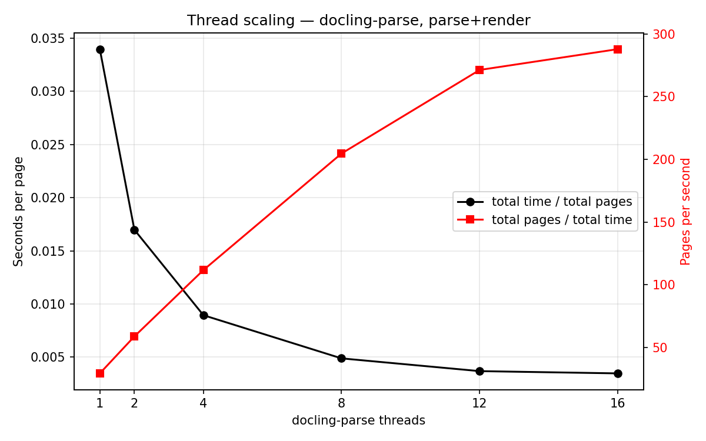
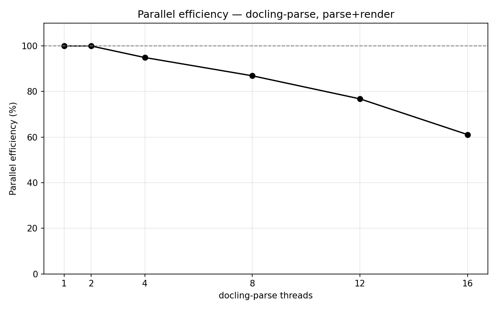

# Performance Benchmarks

## Overview of other open-source, low-level PDF parsers

At the time of writing (date: 3 Aug 2026), we have the following packages (ranked by download numbers),

<table>
  <thead>
    <tr><th align="right">Rank</th><th>Python package</th><th>Primary use</th><th align="right">GitHub stars</th><th align="right">PyPI downloads/month</th></tr>
  </thead>
  <tbody>
    <tr><td align="right">1</td><td><strong>pypdf</strong></td><td>Read, merge, split, crop, encrypt and modify PDFs in pure Python</td><td align="right">~10.1k</td><td align="right"><strong>122,033,329</strong> (<a href="https://github.com/py-pdf/pypdf">GitHub</a>)</td></tr>
    <tr><td align="right">2</td><td><strong>PyMuPDF</strong></td><td>High-performance rendering, extraction, search and modification</td><td align="right">~10.4k</td><td align="right"><strong>106,838,492</strong> (<a href="https://github.com/pymupdf/PyMuPDF">GitHub</a>)</td></tr>
    <tr><td align="right">3</td><td><strong>pypdfium2</strong></td><td>Fast PDFium bindings for rendering, inspection and manipulation</td><td align="right">803</td><td align="right"><strong>74,384,565</strong> (<a href="https://github.com/pypdfium2-team/pypdfium2">GitHub</a>)</td></tr>
    <tr><td align="right">4</td><td><strong>pdfminer.six</strong></td><td>Detailed text extraction, layout analysis and low-level parsing</td><td align="right">~7.0k</td><td align="right"><strong>69,090,692</strong> (<a href="https://github.com/pdfminer/pdfminer.six">GitHub</a>)</td></tr>
    <tr><td align="right">5</td><td><strong>pdfplumber</strong></td><td>Text and table extraction with coordinates and visual debugging</td><td align="right">~10.6k</td><td align="right"><strong>57,151,282</strong> (<a href="https://github.com/jsvine/pdfplumber">GitHub</a>)</td></tr>
    <tr><td align="right">6</td><td><strong>WeasyPrint</strong></td><td>Generate PDFs from HTML and CSS</td><td align="right">~9.5k</td><td align="right"><strong>33,945,746</strong> (<a href="https://github.com/Kozea/WeasyPrint">GitHub</a>)</td></tr>
    <tr><td align="right">7</td><td><strong>fpdf2</strong></td><td>Lightweight programmatic PDF generation</td><td align="right">~1.5k</td><td align="right"><strong>18,548,247</strong> (<a href="https://github.com/py-pdf/fpdf2">GitHub</a>)</td></tr>
    <tr><td align="right">8</td><td><strong>pikepdf</strong></td><td>Robust PDF repair and low-level manipulation using QPDF</td><td align="right">~2.8k</td><td align="right"><strong>9,393,114</strong> (<a href="https://github.com/pikepdf/pikepdf">GitHub</a>)</td></tr>
    <tr><td align="right">9</td><td><strong>OCRmyPDF</strong></td><td>Add searchable OCR layers to scanned PDFs and produce PDF/A</td><td align="right">~34.3k</td><td align="right"><strong>1,107,206</strong> (<a href="https://github.com/ocrmypdf/OCRmyPDF">GitHub</a>)</td></tr>
    <tr><td align="right">10</td><td><strong>camelot-py</strong></td><td>Extract structured tables into pandas DataFrames</td><td align="right">~3.8k</td><td align="right"><strong>771,757</strong> (<a href="https://github.com/camelot-dev/camelot">GitHub</a>)</td></tr>
  </tbody>
</table>

[1]: https://github.com/py-pdf/pypdf "GitHub - py-pdf/pypdf: A pure-python PDF library capable of splitting, merging, cropping, and transforming the pages of PDF files · GitHub"
[2]: https://github.com/pymupdf/PyMuPDF "GitHub - pymupdf/PyMuPDF: PyMuPDF is a high performance Python library for data extraction, analysis, conversion & manipulation of PDF (and other) documents. · GitHub"
[3]: https://github.com/pypdfium2-team/pypdfium2 "GitHub - pypdfium2-team/pypdfium2: Python bindings to PDFium, reasonably cross-platform. · GitHub"
[4]: https://github.com/pdfminer/pdfminer.six "GitHub - pdfminer/pdfminer.six: Community maintained fork of pdfminer - we fathom PDF · GitHub"
[5]: https://github.com/jsvine/pdfplumber "GitHub - jsvine/pdfplumber: Plumb a PDF for detailed information about each char, rectangle, line, et cetera — and easily extract text and tables. · GitHub"
[6]: https://github.com/Kozea/WeasyPrint "GitHub - Kozea/WeasyPrint: The awesome document factory · GitHub"
[7]: https://github.com/py-pdf/fpdf2 "GitHub - py-pdf/fpdf2: Simple PDF generation for Python · GitHub"
[8]: https://github.com/pikepdf/pikepdf "GitHub - pikepdf/pikepdf: A Python library for reading and writing PDF, powered by QPDF · GitHub"
[9]: https://github.com/ocrmypdf/OCRmyPDF "GitHub - ocrmypdf/OCRmyPDF: OCRmyPDF adds an OCR text layer to scanned PDF files, allowing them to be searched · GitHub"
[10]: https://github.com/camelot-dev/camelot "GitHub - camelot-dev/camelot: A Python library to extract tabular data from PDFs · GitHub"

## Performance comparison on parsing and rendering

Here we evaluate the top-5 python packages that provide the parsing (i.e. text-extraction from PDF with location) and page-rendering.

### What is measured

Two tasks are timed:

- **`parse`** — extract the text of every page *together with its location*. Every package therefore uses its position-bearing API, not a plain-text dump.
- **`parse+render`** — the same, plus rasterising the page at `--scale` (`scale=1.0` is 72 dpi) and materialising it as a PIL image.

<table>
  <thead>
    <tr><th>Python package</th><th><code>parse</code></th><th><code>parse+render</code></th></tr>
  </thead>
  <tbody>
    <tr><td><strong>docling-parse</strong></td><td><code>DoclingThreadedPdfParser</code></td><td>+ <code>RenderConfig</code></td></tr>
    <tr><td><strong>PyMuPDF</strong></td><td><code>page.get_text("rawdict")</code></td><td>+ <code>page.get_pixmap()</code> → <code>pil_image()</code></td></tr>
    <tr><td><strong>pypdfium2</strong></td><td>text-page rects + <code>get_text_bounded()</code></td><td>+ <code>page.render()</code> → <code>to_pil()</code></td></tr>
    <tr><td><strong>pdfplumber</strong></td><td><code>page.chars</code></td><td>+ <code>page.to_image()</code></td></tr>
    <tr><td><strong>pdfminer.six</strong></td><td><code>extract_pages()</code> + <code>LTChar</code> walk</td><td>not supported</td></tr>
    <tr><td><strong>pypdf</strong></td><td><code>extract_text(visitor_text=...)</code></td><td>not supported</td></tr>
  </tbody>
</table>

Two notes on fairness. PyMuPDF is timed on `get_text("rawdict")` rather than the much faster `get_text("text")`, because the latter returns a bare string with no geometry and would not be the same task. pdfplumber has no rasteriser of its own — `to_image()` delegates to pypdfium2 — so its render row is pdfminer extraction plus a PDFium raster, which is how a pdfplumber user would in practice obtain both.

pdfminer.six and pypdf have no rendering path at all, so they appear only in the `parse` task.

**Threading.** docling-parse decodes pages in parallel, and to our knowledge none of the other packages expose a thread-safe multi-page pipeline. docling-parse is therefore measured once per thread count, and every other package is measured single-threaded and reported with `threads = 1`.

### Results

#### Parse without bitmap bytes (decode only)

<table>
  <thead>
    <tr><th>Backend</th><th align="right">Threads</th><th align="right">Wall time (s)</th><th align="right">vs threaded (1)</th><th align="right">Efficiency</th><th align="right">vs PyMuPDF (1t)</th><th align="right">vs pypdfium2 (1t)</th><th align="right">vs pdfplumber (1t)</th><th align="right">vs pdfminer.six (1t)</th><th align="right">vs pypdf (1t)</th><th align="right">Pages/sec</th><th align="right">ms/page</th></tr>
  </thead>
  <tbody>
    <tr><td>pymupdf (1t)</td><td align="right">–</td><td align="right">1370.2</td><td align="right">0.22×</td><td align="right"></td><td align="right">1.00×</td><td align="right">0.19×</td><td align="right">1.63×</td><td align="right">1.57×</td><td align="right">0.55×</td><td align="right">39.8</td><td align="right">25.1</td></tr>
    <tr><td>pypdfium2 (1t)</td><td align="right">–</td><td align="right">256.229</td><td align="right">1.17×</td><td align="right"></td><td align="right">5.35×</td><td align="right">1.00×</td><td align="right">8.74×</td><td align="right">8.38×</td><td align="right">2.95×</td><td align="right">213</td><td align="right">4.69</td></tr>
    <tr><td>pdfplumber (1t)</td><td align="right">–</td><td align="right">2239.82</td><td align="right">0.13×</td><td align="right"></td><td align="right">0.61×</td><td align="right">0.11×</td><td align="right">1.00×</td><td align="right">0.96×</td><td align="right">0.34×</td><td align="right">24.4</td><td align="right">41.03</td></tr>
    <tr><td>pdfminer.six (1t)</td><td align="right">–</td><td align="right">2146.92</td><td align="right">0.14×</td><td align="right"></td><td align="right">0.64×</td><td align="right">0.12×</td><td align="right">1.04×</td><td align="right">1.00×</td><td align="right">0.35×</td><td align="right">25.4</td><td align="right">39.33</td></tr>
    <tr><td>pypdf (1t)</td><td align="right">–</td><td align="right">755.656</td><td align="right">0.40×</td><td align="right"></td><td align="right">1.81×</td><td align="right">0.34×</td><td align="right">2.96×</td><td align="right">2.84×</td><td align="right">1.00×</td><td align="right">72.2</td><td align="right">13.84</td></tr>
    <tr><td>docling threaded</td><td align="right">1</td><td align="right">298.603</td><td align="right">1.00×</td><td align="right">100%</td><td align="right">4.59×</td><td align="right">0.86×</td><td align="right">7.50×</td><td align="right">7.19×</td><td align="right">2.53×</td><td align="right">182.8</td><td align="right">5.47</td></tr>
    <tr><td>docling threaded</td><td align="right">2</td><td align="right">156.293</td><td align="right">1.91×</td><td align="right">96%</td><td align="right">8.77×</td><td align="right">1.64×</td><td align="right">14.33×</td><td align="right">13.74×</td><td align="right">4.83×</td><td align="right">349.2</td><td align="right">2.86</td></tr>
    <tr><td>docling threaded</td><td align="right">4</td><td align="right">86.643</td><td align="right">3.45×</td><td align="right">86%</td><td align="right">15.81×</td><td align="right">2.96×</td><td align="right">25.85×</td><td align="right">24.78×</td><td align="right">8.72×</td><td align="right">630</td><td align="right">1.59</td></tr>
    <tr><td>docling threaded</td><td align="right">8</td><td align="right">52.539</td><td align="right">5.68×</td><td align="right">71%</td><td align="right">26.08×</td><td align="right">4.88×</td><td align="right">42.63×</td><td align="right">40.86×</td><td align="right">14.38×</td><td align="right">1038.9</td><td align="right">0.96</td></tr>
    <tr><td>docling threaded</td><td align="right">12</td><td align="right">44.856</td><td align="right">6.66×</td><td align="right">55%</td><td align="right">30.55×</td><td align="right">5.71×</td><td align="right">49.93×</td><td align="right">47.86×</td><td align="right">16.85×</td><td align="right">1216.9</td><td align="right">0.82</td></tr>
    <tr><td>docling threaded</td><td align="right">16</td><td align="right">44.154</td><td align="right">6.76×</td><td align="right">42%</td><td align="right">31.03×</td><td align="right">5.80×</td><td align="right">50.73×</td><td align="right">48.62×</td><td align="right">17.11×</td><td align="right">1236.2</td><td align="right">0.81</td></tr>
  </tbody>
</table>

#### Render (decode + rasterise at scale 2)

<table>
  <thead>
    <tr><th>Backend</th><th align="right">Threads</th><th align="right">Wall time (s)</th><th align="right">vs threaded (1)</th><th align="right">Efficiency</th><th align="right">vs PyMuPDF (1t)</th><th align="right">vs pypdfium2 (1t)</th><th align="right">vs pdfplumber (1t)</th><th align="right">Pages/sec</th><th align="right">ms/page</th></tr>
  </thead>
  <tbody>
    <tr><td>pymupdf (1t)</td><td align="right">–</td><td align="right">2299.18</td><td align="right">0.81×</td><td align="right"></td><td align="right">1.00×</td><td align="right">0.45×</td><td align="right">1.43×</td><td align="right">23.7</td><td align="right">42.12</td></tr>
    <tr><td>pypdfium2 (1t)</td><td align="right">–</td><td align="right">1031.87</td><td align="right">1.80×</td><td align="right"></td><td align="right">2.23×</td><td align="right">1.00×</td><td align="right">3.19×</td><td align="right">52.9</td><td align="right">18.9</td></tr>
    <tr><td>pdfplumber (1t)</td><td align="right">–</td><td align="right">3293.9</td><td align="right">0.56×</td><td align="right"></td><td align="right">0.70×</td><td align="right">0.31×</td><td align="right">1.00×</td><td align="right">16.6</td><td align="right">60.35</td></tr>
    <tr><td>docling threaded</td><td align="right">1</td><td align="right">1858.78</td><td align="right">1.00×</td><td align="right">100%</td><td align="right">1.24×</td><td align="right">0.56×</td><td align="right">1.77×</td><td align="right">29.4</td><td align="right">34.05</td></tr>
    <tr><td>docling threaded</td><td align="right">2</td><td align="right">931.04</td><td align="right">2.00×</td><td align="right">100%</td><td align="right">2.47×</td><td align="right">1.11×</td><td align="right">3.54×</td><td align="right">58.6</td><td align="right">17.06</td></tr>
    <tr><td>docling threaded</td><td align="right">4</td><td align="right">492.556</td><td align="right">3.77×</td><td align="right">94%</td><td align="right">4.67×</td><td align="right">2.09×</td><td align="right">6.69×</td><td align="right">110.8</td><td align="right">9.02</td></tr>
    <tr><td>docling threaded</td><td align="right">8</td><td align="right">270.882</td><td align="right">6.86×</td><td align="right">86%</td><td align="right">8.49×</td><td align="right">3.81×</td><td align="right">12.16×</td><td align="right">201.5</td><td align="right">4.96</td></tr>
    <tr><td>docling threaded</td><td align="right">12</td><td align="right">205.269</td><td align="right">9.06×</td><td align="right">75%</td><td align="right">11.20×</td><td align="right">5.03×</td><td align="right">16.05×</td><td align="right">265.9</td><td align="right">3.76</td></tr>
    <tr><td>docling threaded</td><td align="right">16</td><td align="right">193.763</td><td align="right">9.59×</td><td align="right">60%</td><td align="right">11.87×</td><td align="right">5.33×</td><td align="right">17.00×</td><td align="right">281.7</td><td align="right">3.55</td></tr>
  </tbody>
</table>

#### Linear thread scaling



Wall-clock runtime and throughput by docling-parse thread count. Apple M3 Max; `parse+render`; `scale = 2` (144 dpi).

#### Parallel efficiency



Parallel efficiency relative to the one-thread docling-parse run. Apple M3 Max; `parse+render`; `scale = 2` (144 dpi).

#### Per-page time distributions


Per-page timing distributions for every measured configuration. Apple M3 Max; `parse+render`; `scale = 2` (144 dpi).

#### Per-page correlation against other packages


Per-page timing comparison of docling-parse and pypdfium2; the red diagonal marks equal time. Apple M3 Max; `parse+render`; `scale = 2` (144 dpi).

### Reproducing these numbers

Install the benchmark dependencies (this pulls in every third-party package in the table):

```sh
uv sync --group perf
```

Then run the comparison suite. It downloads the dataset from Hugging Face on first use, runs the requested tasks, prints the tables, and writes a full report:

```sh
uv run python ./scripts/benchmarking/run_performance_benchmarking.py --3rd-party-backends all --only-threaded
```

You only name a directory. The report and the per-page CSV are named `<cpu>_<dataset>_<mode>` — for example `apple_m3_max_performance-dataset-bo767_render.md` — so results from different machines never overwrite each other. Numbers are only comparable within a single row of the *System hardware* column, so the tables in this file are aggregated from those per-machine reports rather than produced in one run.

Each report is self-contained: it records the exact command it was produced by, the dataset name/revision/size, the machine and the version of every benchmarked package, the decode/content/render configs the run was driven with, and all result tables. That is what makes a number here traceable without the terminal scrollback it came from.

Useful variations:

- `--compare` on its own compares only docling-parse against pypdfium2, which is the cheapest meaningful run.
- `--max-pages 5000` caps the total page count for a quick check; the cap is applied in input order and the last document is truncated, so the subset is reproducible.
- `--mode both` runs `parse` and `parse+render` in one go.
- Omitting `--compare` gives the thread-scaling tables instead; that mode writes the per-page CSV only.
- The default `--output-dir` is `./scratch`, so an exploratory run does not touch the docs.

For a stable measurement, run on an otherwise idle machine, and note that the first run of a dataset pays for a cold file cache.

The companion CSV holds one row per `(backend, task, threads, document, page)`, including the rendered `image_width` and `image_height`. It is the input for the render size check and, via `scripts/benchmarking/run_performance_eval.py`, for every plot shown above.

### Overview of Regression and Performance datasets

**docling-project/performance-dataset-bo767** — revision `c684df5`

- number of documents: **753**
- number of pages: **54,584**
- median document: ~30 pages; longest: ~1,600 pages


The distribution is broad and roughly log-uniform between 4 and 200 pages, with a spike of single- and two-page documents (110 of the 753) and a thin tail past 1,000 pages. That spread is why per-page quantiles are computed over pages rather than over documents — a per-document average would be dominated by the short documents, which are the majority by count but a small fraction of the pages.
