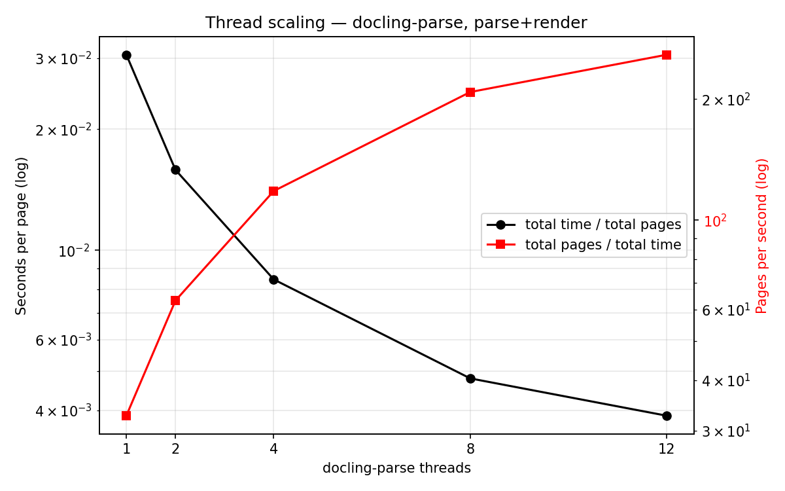
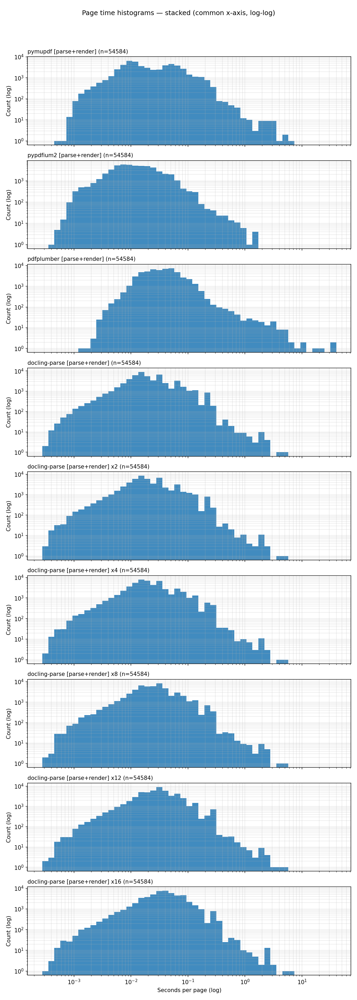
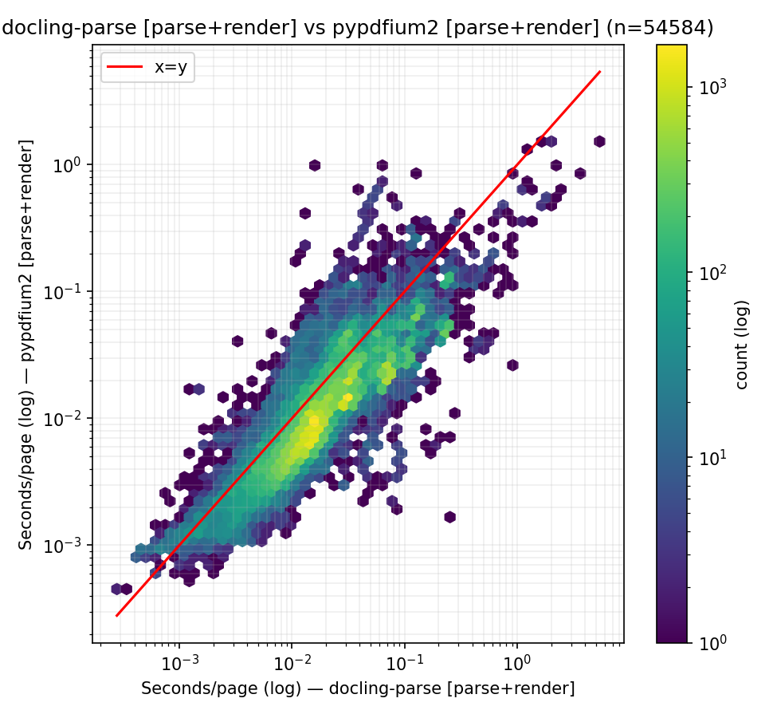
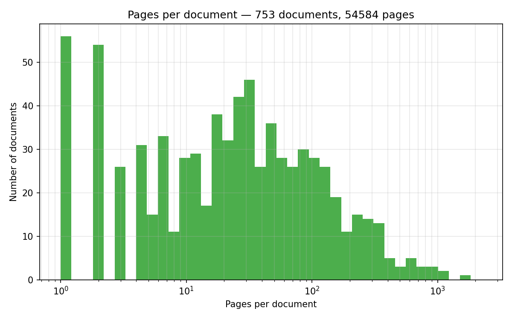

# Performance Benchmarks

## Overview of other open-source, low-level PDF parsers

At the time of writing (date: 3 Aug 2026), we have the following packages (ranked by download numbers),

| Rank | Python package   | Primary use                                                      | GitHub stars |          PyPI downloads/month | 
| ---: | ---------------- | ---------------------------------------------------------------- | -----------: | ----------------------------: |
|    1 | **pypdf**        | Read, merge, split, crop, encrypt and modify PDFs in pure Python |       ~10.1k | **122,033,329** ([GitHub][1]) |
|    2 | **PyMuPDF**      | High-performance rendering, extraction, search and modification  |       ~10.4k | **106,838,492** ([GitHub][2]) |
|    3 | **pypdfium2**    | Fast PDFium bindings for rendering, inspection and manipulation  |          803 |  **74,384,565** ([GitHub][3]) |
|    4 | **pdfminer.six** | Detailed text extraction, layout analysis and low-level parsing  |        ~7.0k |  **69,090,692** ([GitHub][4]) |
|    5 | **pdfplumber**   | Text and table extraction with coordinates and visual debugging  |       ~10.6k |  **57,151,282** ([GitHub][5]) |
|    6 | **WeasyPrint**   | Generate PDFs from HTML and CSS                                  |        ~9.5k |  **33,945,746** ([GitHub][6]) |
|    7 | **fpdf2**        | Lightweight programmatic PDF generation                          |        ~1.5k |  **18,548,247** ([GitHub][7]) |
|    8 | **pikepdf**      | Robust PDF repair and low-level manipulation using QPDF          |        ~2.8k |   **9,393,114** ([GitHub][8]) |
|    9 | **OCRmyPDF**     | Add searchable OCR layers to scanned PDFs and produce PDF/A      |       ~34.3k |   **1,107,206** ([GitHub][9]) |
|   10 | **camelot-py**   | Extract structured tables into pandas DataFrames                 |        ~3.8k |    **771,757** ([GitHub][10]) |

[1]: https://github.com/py-pdf/pypdf "GitHub - py-pdf/pypdf: A pure-python PDF library capable of splitting, merging, cropping, and transforming the pages of PDF files · GitHub"
[2]: https://github.com/pymupdf/PyMuPDF "GitHub - pymupdf/PyMuPDF: PyMuPDF is a high performance Python library for data extraction, analysis, conversion & manipulation of PDF (and other) documents. · GitHub"
[3]: https://github.com/pypdfium2-team/pypdfium2 "GitHub - pypdfium2-team/pypdfium2: Python bindings to PDFium, reasonably cross-platform. · GitHub"
[4]: https://github.com/pdfminer/pdfminer.six "GitHub - pdfminer/pdfminer.six: Community maintained fork of pdfminer - we fathom PDF · GitHub"
[5]: https://github.com/jsvine/pdfplumber "GitHub - jsvine/pdfplumber: Plumb a PDF for detailed information about each char, rectangle, line, et cetera — and easily extract text and tables. · GitHub"
[6]: https://github.com/Kozea/WeasyPrint "GitHub - Kozea/WeasyPrint: The awesome document factory · GitHub"
[7]: https://github.com/py-pdf/fpdf2 "GitHub - py-pdf/fpdf2: Simple PDF generation for Python · GitHub"
[8]: https://github.com/pikepdf/pikepdf "GitHub - pikepdf/pikepdf: A Python library for reading and writing PDF, powered by QPDF · GitHub"
[9]: https://github.com/ocrmypdf/OCRmyPDF "GitHub - ocrmypdf/OCRmyPDF: OCRmyPDF adds an OCR text layer to scanned PDF files, allowing them to be searched · GitHub"
[10]: https://github.com/camelot-dev/camelot "GitHub - camelot-dev/camelot: A Python library to extract tabular data from PDFs · GitHub"

## Performance comparison on parsing and rendering

Here we evaluate the top-5 python packages that provide the parsing (i.e. text-extraction from PDF with location) and page-rendering.

### What is measured

Two tasks are timed:

- **`parse`** — extract the text of every page *together with its location*. Every package therefore uses its position-bearing API, not a plain-text dump.
- **`parse+render`** — the same, plus rasterising the page at `--scale` (`scale=1.0` is 72 dpi) and materialising it as a PIL image.

| Python package | `parse` | `parse+render` |
| -------------- | ------- | -------------- |
| **docling-parse** | `DoclingThreadedPdfParser` | + `RenderConfig` |
| **PyMuPDF** | `page.get_text("rawdict")` | + `page.get_pixmap()` → `pil_image()` |
| **pypdfium2** | text-page rects + `get_text_bounded()` | + `page.render()` → `to_pil()` |
| **pdfplumber** | `page.chars` | + `page.to_image()` |
| **pdfminer.six** | `extract_pages()` + `LTChar` walk | not supported |
| **pypdf** | `extract_text(visitor_text=...)` | not supported |

Two notes on fairness. PyMuPDF is timed on `get_text("rawdict")` rather than the much faster `get_text("text")`, because the latter returns a bare string with no geometry and would not be the same task. pdfplumber has no rasteriser of its own — `to_image()` delegates to pypdfium2 — so its render row is pdfminer extraction plus a PDFium raster, which is how a pdfplumber user would in practice obtain both.

pdfminer.six and pypdf have no rendering path at all, so they appear only in the `parse` task.

**Threading.** docling-parse decodes pages in parallel, and to our knowledge none of the other packages expose a thread-safe multi-page pipeline. docling-parse is therefore measured once per thread count, and every other package is measured single-threaded and reported with `threads = 1`.

### How the numbers are defined

- **total time** is a wall clock around the whole corpus, including opening documents. This is the number that reflects the benefit of threading.
- **average / median / 95 / 99 quantile time per page** describe the cost of a *single* page. They are computed over pages, not over documents, and failed pages are excluded. Because they measure one page's cost, they stay roughly flat as the thread count rises while **total time** drops.
  - For the third-party packages this is a wall-clock timer around each page's work, with document open/close excluded.
  - For docling-parse it is the page timing reported by the C++ layer, since under concurrency no wall-clock interval belongs to a single page. At `threads = 1` the two definitions agree.

A render comparison is only meaningful if every package rasterised the same canvas, so the benchmark records the pixel width and height of each rendered page and reports how far each package deviates from a reference. PDFium is the ground truth — it is the rasteriser that three of the six packages ultimately rely on — and it is run first for that reason. See [Render size agreement](#render-size-agreement) below for what that check found.

### Results

<!-- Generated by scripts/benchmarking/run_performance_benchmarking.py; see docs/performance_benchmarks/ for the full per-machine reports. -->

<table>
  <thead>
    <tr>
      <th colspan="8" align="left">
        <b>System</b> Apple M3 Max · 16 cores · 64 GB RAM · Darwin 25.2.0 · Python 3.12.11<br/>
        <b>Dataset</b> <code>docling-project/performance-dataset-bo767</code> @ <code>c684df5</code> — 753 documents, 54,584 pages<br/>
        <b>Task</b> <code>parse+render</code> at <code>scale = 1.0</code> (72 dpi) · docling-parse 7.8.1
      </th>
    </tr>
    <tr>
      <th rowspan="2" align="left">Python package</th>
      <th rowspan="2">threads</th>
      <th rowspan="2">total time (s)</th>
      <th rowspan="2">pages/sec</th>
      <th colspan="4">time per page</th>
    </tr>
    <tr>
      <th>average</th>
      <th>median</th>
      <th>95 quantile</th>
      <th>99 quantile</th>
    </tr>
  </thead>
  <tbody>
    <tr>
      <td rowspan="4" align="left"><b>docling-parse</b></td>
      <td align="right">1</td><td align="right">1566.96</td><td align="right">34.8</td>
      <td align="right">28.6 ms</td><td align="right">21.5 ms</td><td align="right">70.6 ms</td><td align="right">143.5 ms</td>
    </tr>
    <tr>
      <td align="right">4</td><td align="right">428.41</td><td align="right">127.4</td>
      <td align="right">31.0 ms</td><td align="right">23.6 ms</td><td align="right">75.7 ms</td><td align="right">151.9 ms</td>
    </tr>
    <tr>
      <td align="right">8</td><td align="right">239.03</td><td align="right">228.4</td>
      <td align="right">34.3 ms</td><td align="right">27.1 ms</td><td align="right">80.8 ms</td><td align="right">157.2 ms</td>
    </tr>
    <tr>
      <td align="right"><b>12</b></td><td align="right"><b>187.54</b></td><td align="right"><b>291.0</b></td>
      <td align="right">40.1 ms</td><td align="right">31.0 ms</td><td align="right">94.4 ms</td><td align="right">168.3 ms</td>
    </tr>
    <tr>
      <td align="left">PyMuPDF</td>
      <td align="right">1</td><td align="right">1786.95</td><td align="right">30.5</td>
      <td align="right">32.7 ms</td><td align="right">11.0 ms</td><td align="right">125.3 ms</td><td align="right">235.8 ms</td>
    </tr>
    <tr>
      <td align="left">pypdfium2</td>
      <td align="right">1</td><td align="right">761.86</td><td align="right">71.6</td>
      <td align="right">13.9 ms</td><td align="right">7.6 ms</td><td align="right">41.8 ms</td><td align="right">106.2 ms</td>
    </tr>
    <tr>
      <td align="left">pdfplumber</td>
      <td align="right">1</td><td align="right">2934.31</td><td align="right">18.6</td>
      <td align="right">47.8 ms</td><td align="right">29.2 ms</td><td align="right">118.5 ms</td><td align="right">242.9 ms</td>
    </tr>
    <tr>
      <td align="left">pdfminer.six</td>
      <td colspan="7" align="center"><i>no rendering path — <code>parse</code> only</i></td>
    </tr>
    <tr>
      <td align="left">pypdf</td>
      <td colspan="7" align="center"><i>no rendering path — <code>parse</code> only</i></td>
    </tr>
  </tbody>
</table>

The `parse` task has not been run on this machine yet; those rows come from the same command with `--mode parse`.

**What this says.** Single-threaded, docling-parse (34.8 pages/sec) sits between pypdfium2 (71.6) and PyMuPDF (30.5), with pdfplumber last (18.6). Threading is what separates it: at 12 threads it reaches 291 pages/sec, **4.1× faster than the quickest single-threaded package**, and turns a 26-minute corpus into just over 3 minutes.

Scaling is sub-linear — 12 threads buys 8.4×, not 12× — and the per-page cost climbs from 28.6 ms to 40.1 ms as threads are added, which is the expected memory-bandwidth and allocator contention rather than a change in the work done.

The speedup table is reported separately because it compares *wall time between runs* rather than per-page cost. Each cell is `column_total_time / row_total_time`, so a value above `1.00x` means the row finished the corpus faster than the column.

<table>
  <thead>
    <tr>
      <th rowspan="2" align="left">Python package</th>
      <th rowspan="2">threads</th>
      <th rowspan="2">total time (s)</th>
      <th rowspan="2">pages/sec</th>
      <th colspan="4">speedup versus each single-threaded baseline</th>
    </tr>
    <tr>
      <th>docling-parse (1t)</th>
      <th>PyMuPDF (1t)</th>
      <th>pypdfium2 (1t)</th>
      <th>pdfplumber (1t)</th>
    </tr>
  </thead>
  <tbody>
    <tr>
      <td rowspan="4" align="left"><b>docling-parse</b></td>
      <td align="right">1</td><td align="right">1566.96</td><td align="right">34.8</td>
      <td align="right">1.00x</td><td align="right">1.14x</td><td align="right">0.49x</td><td align="right">1.87x</td>
    </tr>
    <tr>
      <td align="right">4</td><td align="right">428.41</td><td align="right">127.4</td>
      <td align="right">3.66x</td><td align="right">4.17x</td><td align="right">1.78x</td><td align="right">6.85x</td>
    </tr>
    <tr>
      <td align="right">8</td><td align="right">239.03</td><td align="right">228.4</td>
      <td align="right">6.56x</td><td align="right">7.48x</td><td align="right">3.19x</td><td align="right">12.28x</td>
    </tr>
    <tr>
      <td align="right"><b>12</b></td><td align="right"><b>187.54</b></td><td align="right"><b>291.0</b></td>
      <td align="right"><b>8.36x</b></td><td align="right"><b>9.53x</b></td><td align="right"><b>4.06x</b></td><td align="right"><b>15.65x</b></td>
    </tr>
    <tr>
      <td align="left">PyMuPDF</td>
      <td align="right">1</td><td align="right">1786.95</td><td align="right">30.5</td>
      <td align="right">0.88x</td><td align="right">1.00x</td><td align="right">0.43x</td><td align="right">1.64x</td>
    </tr>
    <tr>
      <td align="left">pypdfium2</td>
      <td align="right">1</td><td align="right">761.86</td><td align="right">71.6</td>
      <td align="right">2.06x</td><td align="right">2.35x</td><td align="right">1.00x</td><td align="right">3.85x</td>
    </tr>
    <tr>
      <td align="left">pdfplumber</td>
      <td align="right">1</td><td align="right">2934.31</td><td align="right">18.6</td>
      <td align="right">0.53x</td><td align="right">0.61x</td><td align="right">0.26x</td><td align="right">1.00x</td>
    </tr>
  </tbody>
</table>

#### Thread scaling



Seconds per page (black, left axis) and pages per second (red, right axis) against thread count, both log-scaled. The curve flattens past 8 threads on this 16-core machine.

#### Per-page time distributions



One panel per configuration, on a common log-log axis. Two things are visible here that the summary table hides. First, docling-parse's distribution barely moves across thread counts — the per-page *cost* is stable, the thread count changes only how many pages run at once. Second, the packages differ more in their tails than in their centres: PyMuPDF has the fastest median of any package (11.0 ms) but a 99th percentile of 235.8 ms, so its mean is dragged out to 32.7 ms. docling-parse has a higher median (21.5 ms) and a much tighter tail (143.5 ms at p99), which is why it wins on total time despite the slower median.

#### Per-page correlation against other packages



Every page plotted twice — docling-parse on the x-axis, the other package on the y — with the `x=y` diagonal in red. Points above the line are pages the other package took longer on. The bulk sits below the diagonal against pypdfium2, matching its 2.06× single-threaded lead, but the correlation is loose: the two disagree by more than an order of magnitude on many individual pages, so neither is uniformly faster page by page. The equivalent plots for [PyMuPDF](./performance_benchmarks/apple_m3_max_performance-dataset-bo767_render/hex_loglog_docling-parse-parse-render-_vs_pymupdf-parse-render-.png) and [pdfplumber](./performance_benchmarks/apple_m3_max_performance-dataset-bo767_render/hex_loglog_docling-parse-parse-render-_vs_pdfplumber-parse-render-.png) are in the same directory.

#### Render size agreement

Every rendered page's pixel size, compared against pypdfium2 with a 2 px tolerance:

| Python package | pages compared | within tolerance | max delta (px) | worst page |
| -------------- | -------------: | ---------------: | -------------: | ---------- |
| **docling-parse** | 54,584 | **95.6%** | **864** | `2216123.pdf` p56 — `2160x3024` vs `3024x2160` |
| PyMuPDF | 54,584 | 100.0% | 1 | `1048308.pdf` p2 — `612x792` vs `613x793` |
| pdfplumber | 54,584 | 100.0% | 1 | `1057315.pdf` p80 — `612x791` vs `612x792` |

PyMuPDF and pdfplumber agree with PDFium everywhere to within a single pixel of rounding. **docling-parse does not**: on roughly 4.4% of pages (~2,400) the canvas differs, and the worst case is a clean transpose — `2160x3024` where PDFium produced `3024x2160`. That is a page-rotation discrepancy, not a rounding one, and it is a correctness issue rather than a performance one. The timing numbers above are still like-for-like (a transposed canvas has the same pixel count and costs the same to fill), but the affected pages are rendered in the wrong orientation. This needs its own fix; see the note in the dataset section below.

### Reproducing these numbers

Install the benchmark dependencies (this pulls in every third-party package in the table):

```sh
uv sync --group perf
```

Then run the comparison suite. It downloads the dataset from Hugging Face on first use, runs the requested tasks, prints the tables, and writes a full report:

```sh
uv run python ./scripts/benchmarking/run_performance_benchmarking.py \
    --threads 1,4,8,12 \
    --compare all \
    --mode render \
    --output-dir ./docs/performance_benchmarks/
```

You only name a directory. The report and the per-page CSV are named `<cpu>_<dataset>_<mode>` — for example `apple_m3_max_performance-dataset-bo767_render.md` — so results from different machines never overwrite each other. Numbers are only comparable within a single row of the *System hardware* column, so the tables in this file are aggregated from those per-machine reports rather than produced in one run.

Each report is self-contained: it records the exact command it was produced by, the dataset name/revision/size, the machine and the version of every benchmarked package, the decode/content/render configs the run was driven with, and all result tables. That is what makes a number here traceable without the terminal scrollback it came from.

Useful variations:

- `--compare` on its own compares only docling-parse against pypdfium2, which is the cheapest meaningful run.
- `--max-pages 5000` caps the total page count for a quick check; the cap is applied in input order and the last document is truncated, so the subset is reproducible.
- `--mode both` runs `parse` and `parse+render` in one go.
- Omitting `--compare` gives the thread-scaling tables instead; that mode writes the per-page CSV only.
- The default `--output-dir` is `./scratch`, so an exploratory run does not touch the docs.

For a stable measurement, run on an otherwise idle machine, and note that the first run of a dataset pays for a cold file cache.

The companion CSV holds one row per `(backend, task, threads, document, page)`, including the rendered `image_width` and `image_height`. It is the input for the render size check and, via `scripts/benchmarking/run_performance_eval.py`, for every plot shown above.

### Overview of Regression and Performance datasets

**docling-project/performance-dataset-bo767** — revision `c684df5`

- number of documents: **753**
- number of pages: **54,584**
- median document: ~30 pages; longest: ~1,600 pages



The distribution is broad and roughly log-uniform between 4 and 200 pages, with a spike of single- and two-page documents (110 of the 753) and a thin tail past 1,000 pages. That spread is why per-page quantiles are computed over pages rather than over documents — a per-document average would be dominated by the short documents, which are the majority by count but a small fraction of the pages.

The per-page time distributions for this dataset are in [Per-page time distributions](#per-page-time-distributions) above.

**docling-project/regression-dataset-for-docling-parse**

- number of documents: ??
- number of pages: ??

Not yet benchmarked. Run the same command against this repo id to produce the equivalent report and plots.

#### Open items

- `parse`-task numbers for both datasets (`--mode parse`).
- The **page-rotation discrepancy** surfaced by the render size check: ~4.4% of pages in bo767 render at a different canvas than PDFium, the worst being a clean width/height transpose. The per-page CSV records `image_width` and `image_height` for every page, so the affected pages can be listed directly from it.

The document and page counts are printed by any `run_performance_benchmarking.py` invocation. The distributions are produced by `scripts/benchmarking/run_performance_eval.py` from the per-page CSV, which carries the per-page time and rendered canvas size for each backend and task alongside the document key:

```sh
uv run python ./scripts/benchmarking/run_performance_eval.py \
    ./docs/performance_benchmarks/apple_m3_max_performance-dataset-bo767_render.csv
```

Plots land next to the report, in a directory named after the CSV.
