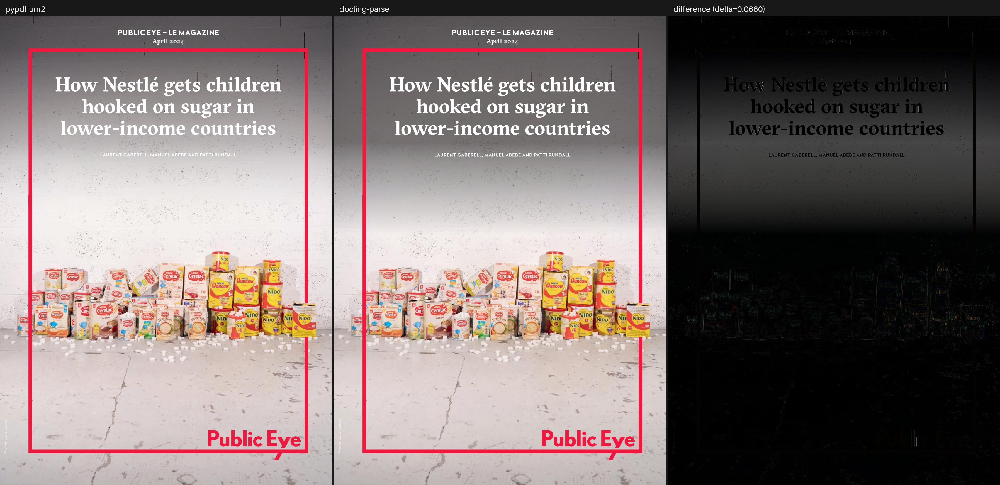
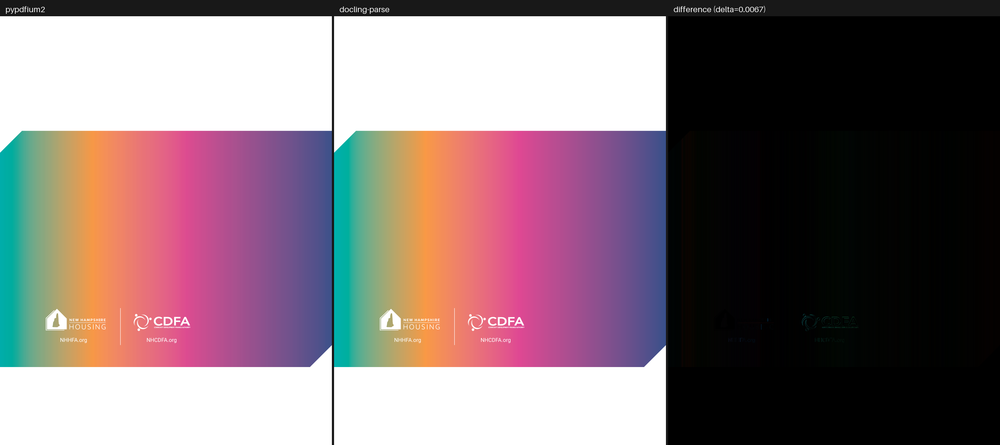
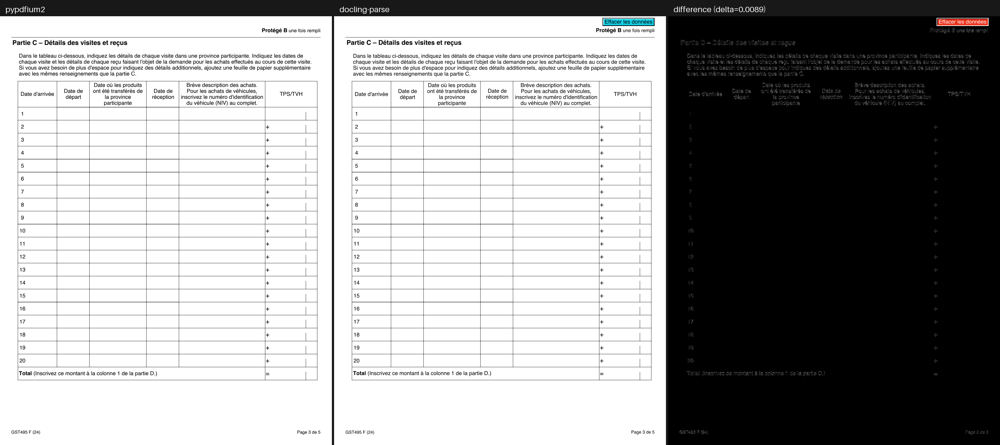

# Quality Benchmarks

Rendering quality of `docling-parse` measured against **pypdfium2** on the
regression corpus: 143 pages across 110 documents, rasterised twice and compared
pixel by pixel.

PDFium is the reference because it is an independent, widely deployed
implementation of the same specification — not because it is correct by
definition. A difference is a question to investigate, not automatically a bug
in `docling-parse`. Nothing on this page is a CI gate; the numbers are a report.

## Reproducing

```console
uv run pytest tests/test_pypdfium_render.py -q -s --render-visualizations all
```

The test prints the table below and writes one three-panel PNG per page into
`tests/data/visualizations/`. The images in [`./quality_benchmarks/`](./quality_benchmarks/)
are that output, copied in.

`--render-visualizations` selects how much is written:

| value | writes a visualisation for |
| --- | --- |
| `all` | every page |
| `above-tolerance` | only pages over the reporting cut-off (the default) |
| `none` | nothing |

Two run-level histograms land in the same folder for every value except
`none` — `histogram_delta.png` and `histogram_mean_abs_error.png`. Each shows
the distribution of that metric over the whole corpus on a logarithmic page
count, with the median, the mean and (for `mean_abs_error`) the reporting
cut-off marked. They are what to look at after changing a decoder: a per-page
panel says what is wrong with one page, the histogram says whether the corpus
as a whole moved. Writing them needs `matplotlib` from the `perf` dependency
group; without it the run silently skips them and still prints the table.

Both renderers work at `scale = 2.0` (144 dpi). The test never fails on pixel
differences — it fails only when there is nothing to compare, e.g. when
`pypdfium2` is not installed.

## How to read a visualisation

Each PNG holds three panels of the same page:

| panel | content |
| --- | --- |
| left | `pypdfium2` — the reference render |
| centre | `docling-parse` — the Blend2D render |
| right | the per-pixel absolute difference of the two |

The difference panel carries **no brightness scaling**. A grey level of 40 means
the two renders are 40 apart at that pixel, and black means they agree. That
also makes any two panels directly comparable: they are produced by the same
fixed transform, so a panel from one page can be held next to a panel from
another. Amplifying — even by a constant — would break that, by making a
near-identical page look as damaged as a broken one.

The price is that an accurate page shows an almost black panel. That is the
honest depiction of two renders agreeing, and the metrics below are what
resolve differences too small to see.


*The closest page in the corpus (`delta = 0.0002`, `mean_abs_error = 0.0295`):
the difference panel is black. The two renderers put this page on screen the
same way.*

## Metrics

Both renders are composited onto opaque white before anything is measured —
`pypdfium2` paints an opaque page while the Blend2D path can leave the
background transparent, and comparing them only makes sense on a common
background.

**`delta`** — the headline number, on a **0.0 – 1.0** scale.

> Per pixel, take the *largest* of the three channel differences and divide by
> 255; the score is the mean of that over the page.

`0.0` is a pixel-identical render and `1.0` is every pixel maximally inverted —
a bound that is actually attainable, which is what makes the number comparable
across pages of different size. A page that differs on 5 % of its area, fully,
scores `0.0500`; the same 5 % differing by half scores `0.0249`.

Two deliberate choices behind it. Alpha is excluded, since after flattening both
alpha channels are identical by construction. And the channels are combined with
`max()` rather than averaged: a glyph painted pure blue where it should be black
differs by 255 in one channel, which a mean reports as 85 and a luma weighting
as 29 — both understating a difference that is entirely obvious on screen.

`delta` is still an average over the whole page, so it is dominated by page
area. A mostly-white page with badly wrong text scores low in absolute terms.
It ranks pages against each other; it does not say "this render is 3 % wrong".

The remaining columns are the raw quantities it is derived from:

| column | meaning |
| --- | --- |
| `canvas` | render size in pixels; `pypdfium2` and `docling-parse` agreed exactly on all 143 pages |
| `mean_abs_error` | mean absolute per-channel deviation over RGBA, in 0–255 units. Alpha is constant, so this saturates at 191.25 rather than 255 |
| `changed_pixels_ratio` | fraction of pixels whose luma-weighted difference exceeds 12 |
| `max_abs_error` | largest single-channel deviation anywhere on the page |
| `changed_pixels` | absolute count behind `changed_pixels_ratio` |

## Summary

| statistic | `mean_abs_error` | `delta` |
| --- | ---: | ---: |
| best page | 0.0295 | 0.0002 |
| median | 1.8088 | 0.0100 |
| mean | 2.0583 | 0.0116 |
| 95th percentile | 4.4432 | 0.0290 |
| worst page | 11.9443 | 0.0660 |

| | pages |
| --- | ---: |
| `delta` < 0.01 | 71 / 143 (50 %) |
| `delta` < 0.02 | 123 / 143 (86 %) |
| `delta` < 0.05 | 141 / 143 (99 %) |
| `delta` < 0.10 | 143 / 143 (100 %) |

All but one page of the corpus sits below a `delta` of `0.05`, and the tail is
now a single page: `complex_invisible_fonts_01.pdf`, which is also the worst by
`mean_abs_error`. Everything below it is within a factor of two of the median,
which is the level at which the difference is anti-aliasing rather than
decoding.

## The tail

### `complex_invisible_fonts_01.pdf` page 1 — `mean_abs_error` 11.94, `delta` 0.0660



One of two pages left above a `delta` of `0.05`, with about a third of pixels
differing (`changed_pixels_ratio = 0.3270`). Not yet characterised.

### `device_n_black.pdf` page 1 — `mean_abs_error` 48.37 → 0.79, `delta` 0.3618 → 0.0067



This page previously rendered blank and was the worst page in the corpus. The
cause was not the one this section used to name: the page is a full-width banner
painted by a single `sh`
operator under a hexagonal clip path, and `renderer<BLEND2D>::render_shading`
skipped any shading whose clip was not an axis-aligned rectangle, because
Blend2D clips to rectangles only and an unclipped fill would have flooded the
page. Everything else on the page is white ink on that banner, so skipping the
one shading left nothing at all.

A shading fills its clip region and nothing else, which means the clip can be
the *fill geometry* instead of a clip: `render_shading` now fills the clip
outline with the gradient, and only falls back to skipping when no clip path
can be honoured at all. That brought the page to `delta` 0.1160 — the banner
appeared, in the wrong colours, because it is `/DeviceCMYK` and the CMYK
conversion was the textbook subtractive formula. Replacing that conversion
(below) took the page the rest of the way to 0.0067.

The limitation this section previously named was real, and is also fixed:
`pdf_resource<PAGE_COLORSPACE>` now evaluates the tint transform of
`/Separation` and `/DeviceN` colour spaces into their alternate space rather
than approximating a tint by darkening towards black. It only happens not to be
what made *this* page the worst one. `font_07.pdf` is where it shows: pages 3
and 4 of that document went from `delta` 0.60 and 0.48 to 0.010 and 0.008.

### DeviceCMYK, across the corpus

`/DeviceCMYK` has no colorimetric definition — 8.6.4.4 calls it
device-dependent — so every reader picks a rendering. The one that was in place
here was the textbook subtractive formula, `R = (1-C)(1-K)`, which assumes
perfect inks on perfect paper: solid cyan came out as `#00FFFF` where a press
gives `#00AEEF`, solid K as `#000000` where a press gives `#231F20`, and CMY at
100 % as pure black rather than the muddy `#414042` that comes off the sheet.
Any page with saturated ink looked like a screen gamut.

`src/parse/utils/color/device_cmyk.h` replaces it with the standard printing
model for the same question — Neugebauer with a Yule-Nielsen exponent — fitted
to a SWOP-coated press, and shared by the `k`/`K` operators, the colour-space
resource and the renderer's CMYK image path. Over a 9x9x9x9 sweep it tracks the
PDFium/Acrobat rendering within a mean of 6.1 and a maximum of 24 code values,
against 26.1 and 115 for the subtractive formula, and it is exact along the
neutral K-only axis where most CMYK ink on a page actually sits.

Twenty of the 108 pages moved; all of them improved. The largest were
`device_n_black.pdf` (`delta` 0.1160 → 0.0067), `cropbox_versus_mediabox_02.pdf`
page 1 (0.0711 → 0.0201) and `font_10.pdf` (0.0419 → 0.0168).

### Tint colour spaces on images

Evaluating a tint transform for the colour *operators* left the same gap on the
image side, where the colour space is resolved separately: `/Separation` was not
recognised at all, so an image in one decoded to nothing and the renderer drew
its "missing pixels" placeholder over the page, and `/DeviceN` was handled by
reading the tints as if they were device components — one colorant as grey,
four as CMYK — which is right only when the colorants happen to be process inks.

`pdf_resource<PAGE_XOBJECT_IMAGE>` now resolves both through the same
`pdf_resource<PAGE_COLORSPACE>` the operators use, and `pdf_state<BITMAP>` runs
the samples through the tint transform into RGB once the pixels are decoded. A
single colorant — every `/Separation`, and most `/DeviceN` images — has 256
possible tints, so it goes through a lookup table rather than the transform per
pixel. Where no usable transform exists the previous component-count reading is
kept, including the inverted default `/Decode` that a lone `/Black` tint needs.

Ten pages moved, all improving. The clearest is a cover page whose artwork is a
`/Separation /Black` image: `delta` 0.3151 → 0.0089, from a flat olive
placeholder to the reference render.

### `form_fields.pdf` and `fillable_form.pdf`



This page was also a historical outlier. Each text field emits a
`text_widget_instruction`, which `renderer<BLEND2D>::render_widget` paints as a
translucent light-blue quadrilateral over the field's bounds — a debug
visualisation PDFium has no counterpart for — and a form-heavy page therefore
differed across every field. The overlay is now opt-in:
`render_config::display_widgets` defaults to `false`, so a default render draws
only the field content. That is what the table below now measures, and
`form_fields.pdf` page 3 falls from `delta` 0.2192 to 0.0089, `fillable_form.pdf`
from 0.1578 to 0.0169. Setting `display_widgets` to `true` (colour configurable
through `render_config::color_widgets`) brings the overlay, and those numbers,
back.

## Per-page results

Sorted by `mean_abs_error`, worst first, as the test prints them. The `delta`
value links to that page's three-panel visualisation.

The numbers are re-measured; the linked panels are not. Twenty rows moved with
the shading-clip, tint transform and DeviceCMYK fixes, and the widget overlay
becoming opt-in, so on those rows the panel shows the older render and its file
name carries the older `delta`. Re-running the benchmark replaces both.

<!-- Generated from `pytest tests/test_pypdfium_render.py --render-visualizations all`. -->

| document | page | canvas | mean_abs_error | delta | changed_pixels_ratio | max_abs_error | changed_pixels |
| --- | ---: | :---: | ---: | ---: | ---: | ---: | ---: |
| `complex_invisible_fonts_01.pdf` | 1 | 1191x1684 | 11.9443 | [0.0660](./quality_benchmarks/delta_0.0660_complex_invisible_fonts_01.pdf.page_no_1.png) | 0.3270 | 151 | 655,777 |
| `dln_e79b4ce5502c8ab0d501fe6ad538b95c1c526d785fdb03f4c527e859424d4ca0.pdf` | 1 | 1220x1548 | 7.0175 | [0.0367](./quality_benchmarks/delta_0.0367_dln_e79b4ce5502c8ab0d501fe6ad538b95c1c526d785fdb03f4c527e859424d4ca0.pdf.page_no_1.png) | 0.1327 | 244 | 250,590 |
| `form_fields.pdf` | 5 | 1224x1584 | 6.3898 | [0.0347](./quality_benchmarks/delta_0.0347_form_fields.pdf.page_no_5.png) | 0.1412 | 255 | 273,842 |
| `dln_d015b15a84ca0176396d123ad3145f6780bbc67027391a5e61dea6de79c9bca1.pdf` | 1 | 1220x1556 | 5.7063 | [0.0298](./quality_benchmarks/delta_0.0298_dln_d015b15a84ca0176396d123ad3145f6780bbc67027391a5e61dea6de79c9bca1.pdf.page_no_1.png) | 0.0960 | 255 | 182,275 |
| `dln_95a44d0ee13e7480c6428b75731a84fb38155f8e870ac1f62112bc8a9bc8f9b9.pdf` | 1 | 1240x1560 | 5.6702 | [0.0296](./quality_benchmarks/delta_0.0296_dln_95a44d0ee13e7480c6428b75731a84fb38155f8e870ac1f62112bc8a9bc8f9b9.pdf.page_no_1.png) | 0.1215 | 255 | 235,035 |
| `dln_23cb379bc6159a37e5488b65bb08ad295ce3ff21d9ddf682064330594ad59db3.pdf` | 1 | 1225x1584 | 5.0977 | [0.0534](./quality_benchmarks/delta_0.0534_dln_23cb379bc6159a37e5488b65bb08ad295ce3ff21d9ddf682064330594ad59db3.pdf.page_no_1.png) | 0.1306 | 190 | 253,434 |
| `cropbox_versus_mediabox_02.pdf` | 2 | 1088x1266 | 4.5794 | [0.0312](./quality_benchmarks/delta_0.0312_cropbox_versus_mediabox_02.pdf.page_no_2.png) | 0.1140 | 255 | 157,059 |
| `ligatures_01.pdf` | 2 | 1224x1584 | 4.4514 | [0.0233](./quality_benchmarks/delta_0.0233_ligatures_01.pdf.page_no_2.png) | 0.1274 | 175 | 246,953 |
| `11831013430589524848.pdf` | 1 | 1440x1080 | 4.3695 | [0.0310](./quality_benchmarks/delta_0.0310_11831013430589524848.pdf.page_no_1.png) | 0.1475 | 255 | 229,406 |
| `complex_invisible_fonts_02.pdf` | 1 | 1191x1684 | 4.3643 | [0.0237](./quality_benchmarks/delta_0.0237_complex_invisible_fonts_02.pdf.page_no_1.png) | 0.1089 | 183 | 218,482 |
| `ccitt_complex_image_scan.pdf` | 1 | 1224x1584 | 4.1427 | [0.0217](./quality_benchmarks/delta_0.0217_ccitt_complex_image_scan.pdf.page_no_1.png) | 0.0786 | 255 | 152,350 |
| `dln_e6440698be04bc45aa418cf0b4ab7b284d9bd397d9ed0c0edfaf1a5a07d73539.pdf` | 1 | 1210x1544 | 4.0760 | [0.0213](./quality_benchmarks/delta_0.0213_dln_e6440698be04bc45aa418cf0b4ab7b284d9bd397d9ed0c0edfaf1a5a07d73539.pdf.page_no_1.png) | 0.0885 | 253 | 165,268 |
| `ligatures_01.pdf` | 3 | 1224x1584 | 3.9517 | [0.0207](./quality_benchmarks/delta_0.0207_ligatures_01.pdf.page_no_3.png) | 0.1139 | 201 | 220,795 |
| `dln_1730803b2ced312e09bec6cf8f8138db7ae38a733596991951d13cb9360238ad.pdf` | 1 | 1210x1544 | 3.9374 | [0.0206](./quality_benchmarks/delta_0.0206_dln_1730803b2ced312e09bec6cf8f8138db7ae38a733596991951d13cb9360238ad.pdf.page_no_1.png) | 0.0935 | 252 | 174,756 |
| `indexed_iccbased.pdf` | 1 | 1224x1512 | 3.6519 | [0.0205](./quality_benchmarks/delta_0.0205_indexed_iccbased.pdf.page_no_1.png) | 0.1234 | 155 | 228,284 |
| `stream_parameter_misinterpretation_01.pdf` | 1 | 1224x1584 | 3.5457 | [0.0188](./quality_benchmarks/delta_0.0188_stream_parameter_misinterpretation_01.pdf.page_no_1.png) | 0.0962 | 255 | 186,543 |
| `6480366468566741514.pdf` | 1 | 1190x1684 | 3.4959 | [0.0206](./quality_benchmarks/delta_0.0206_6480366468566741514.pdf.page_no_1.png) | 0.1038 | 218 | 208,021 |
| `ligatures_01.pdf` | 4 | 1224x1584 | 3.4357 | [0.0183](./quality_benchmarks/delta_0.0183_ligatures_01.pdf.page_no_4.png) | 0.0946 | 241 | 183,503 |
| `font_06.pdf` | 1 | 1190x1588 | 3.4216 | [0.0179](./quality_benchmarks/delta_0.0179_font_06.pdf.page_no_1.png) | 0.0952 | 255 | 179,826 |
| `device_gray_01.pdf` | 1 | 1224x1584 | 3.3863 | [0.0177](./quality_benchmarks/delta_0.0177_device_gray_01.pdf.page_no_1.png) | 0.0604 | 255 | 117,038 |
| `font_05.pdf` | 1 | 868x1327 | 3.3510 | [0.0175](./quality_benchmarks/delta_0.0175_font_05.pdf.page_no_1.png) | 0.0951 | 163 | 109,555 |
| `form_fields.pdf` | 4 | 1224x1584 | 3.3021 | [0.0183](./quality_benchmarks/delta_0.0183_form_fields.pdf.page_no_4.png) | 0.0724 | 255 | 140,466 |
| `font_07.pdf` | 1 | 1191x1571 | 3.2894 | [0.0181](./quality_benchmarks/delta_0.0181_font_07.pdf.page_no_1.png) | 0.0972 | 210 | 181,944 |
| `cropbox_versus_mediabox_01.pdf` | 1 | 1191x1684 | 3.2690 | [0.0174](./quality_benchmarks/delta_0.0174_cropbox_versus_mediabox_01.pdf.page_no_1.png) | 0.0850 | 224 | 170,531 |
| `font_09.pdf` | 1 | 1190x1684 | 3.2271 | [0.0169](./quality_benchmarks/delta_0.0169_font_09.pdf.page_no_1.png) | 0.0959 | 166 | 192,190 |
| `rotated_text_07.pdf` | 1 | 1190x1684 | 3.2165 | [0.0168](./quality_benchmarks/delta_0.0168_rotated_text_07.pdf.page_no_1.png) | 0.0503 | 255 | 100,819 |
| `fillable_form.pdf` | 1 | 1224x1584 | 3.1795 | [0.0169](./quality_benchmarks/delta_0.0169_fillable_form.pdf.page_no_1.png) | 0.0440 | 255 | 85,211 |
| `indexed_device_n.pdf` | 1 | 2382x1684 | 3.0675 | [0.0223](./quality_benchmarks/delta_0.0223_indexed_device_n.pdf.page_no_1.png) | 0.0762 | 202 | 305,850 |
| `complex_invisible_fonts_05.pdf` | 1 | 1191x1684 | 3.0493 | [0.0208](./quality_benchmarks/delta_0.0208_complex_invisible_fonts_05.pdf.page_no_1.png) | 0.0728 | 155 | 146,038 |
| `complex_invisible_fonts_04.pdf` | 1 | 1191x1684 | 2.9795 | [0.0203](./quality_benchmarks/delta_0.0203_complex_invisible_fonts_04.pdf.page_no_1.png) | 0.0699 | 152 | 140,287 |
| `ligatures_01.pdf` | 1 | 1224x1584 | 2.9535 | [0.0157](./quality_benchmarks/delta_0.0157_ligatures_01.pdf.page_no_1.png) | 0.0848 | 255 | 164,398 |
| `annots_01.pdf` | 1 | 1191x1684 | 2.8965 | [0.0167](./quality_benchmarks/delta_0.0167_annots_01.pdf.page_no_1.png) | 0.0717 | 255 | 143,766 |
| `dln_94fc1166595d391ee1cf7d160726b387557ff72ba99bc1b17dd1cb808a5490ed.pdf` | 1 | 1224x1584 | 2.8523 | [0.0151](./quality_benchmarks/delta_0.0151_dln_94fc1166595d391ee1cf7d160726b387557ff72ba99bc1b17dd1cb808a5490ed.pdf.page_no_1.png) | 0.0680 | 224 | 131,843 |
| `2508.13113v2.pdf` | 9 | 1224x1584 | 2.7744 | [0.0150](./quality_benchmarks/delta_0.0150_2508.13113v2.pdf.page_no_9.png) | 0.0746 | 255 | 144,559 |
| `math_latex_formulas.pdf` | 3 | 1224x1584 | 2.7421 | [0.0147](./quality_benchmarks/delta_0.0147_math_latex_formulas.pdf.page_no_3.png) | 0.0537 | 237 | 104,081 |
| `font_11.pdf` | 2 | 1191x1582 | 2.7404 | [0.0147](./quality_benchmarks/delta_0.0147_font_11.pdf.page_no_2.png) | 0.0833 | 191 | 156,975 |
| `dln_bf963befd079febf2803a959166b7c61251d9fcc0a8fdaf779bd0101532c3cde.pdf` | 1 | 1224x1584 | 2.7285 | [0.0143](./quality_benchmarks/delta_0.0143_dln_bf963befd079febf2803a959166b7c61251d9fcc0a8fdaf779bd0101532c3cde.pdf.page_no_1.png) | 0.0721 | 232 | 139,786 |
| `form_fields.pdf` | 1 | 1224x1584 | 2.7175 | [0.0154](./quality_benchmarks/delta_0.0154_form_fields.pdf.page_no_1.png) | 0.0539 | 255 | 104,500 |
| `4865216256588543301.pdf` | 6 | 1191x1684 | 2.7170 | [0.0142](./quality_benchmarks/delta_0.0142_4865216256588543301.pdf.page_no_6.png) | 0.0676 | 250 | 135,504 |
| `4865216256588543301.pdf` | 3 | 1191x1684 | 2.7078 | [0.0142](./quality_benchmarks/delta_0.0142_4865216256588543301.pdf.page_no_3.png) | 0.0675 | 238 | 135,472 |
| `4865216256588543301.pdf` | 4 | 1191x1684 | 2.6585 | [0.0139](./quality_benchmarks/delta_0.0139_4865216256588543301.pdf.page_no_4.png) | 0.0666 | 235 | 133,521 |
| `table_of_contents_01.pdf` | 2 | 1224x1584 | 2.6488 | [0.0139](./quality_benchmarks/delta_0.0139_table_of_contents_01.pdf.page_no_2.png) | 0.0790 | 167 | 153,220 |
| `type3_fonts.pdf` | 1 | 1224x1584 | 2.6464 | [0.0138](./quality_benchmarks/delta_0.0138_type3_fonts.pdf.page_no_1.png) | 0.0527 | 255 | 102,184 |
| `table_of_contents_01.pdf` | 3 | 1224x1584 | 2.6457 | [0.0138](./quality_benchmarks/delta_0.0138_table_of_contents_01.pdf.page_no_3.png) | 0.0754 | 161 | 146,113 |
| `table_of_contents_01.pdf` | 4 | 1224x1584 | 2.6434 | [0.0138](./quality_benchmarks/delta_0.0138_table_of_contents_01.pdf.page_no_4.png) | 0.0770 | 174 | 149,324 |
| `math_latex_formulas.pdf` | 1 | 1224x1584 | 2.6421 | [0.0141](./quality_benchmarks/delta_0.0141_math_latex_formulas.pdf.page_no_1.png) | 0.0514 | 242 | 99,751 |
| `cropbox_versus_mediabox_02.pdf` | 1 | 1088x1266 | 2.6279 | [0.0201](./quality_benchmarks/delta_0.0201_cropbox_versus_mediabox_02.pdf.page_no_1.png) | 0.0329 | 162 | 45,279 |
| `4865216256588543301.pdf` | 5 | 1191x1684 | 2.6221 | [0.0137](./quality_benchmarks/delta_0.0137_4865216256588543301.pdf.page_no_5.png) | 0.0658 | 238 | 131,977 |
| `2508.13113v2.pdf` | 2 | 1224x1584 | 2.6204 | [0.0143](./quality_benchmarks/delta_0.0143_2508.13113v2.pdf.page_no_2.png) | 0.0767 | 255 | 148,642 |
| `font_11.pdf` | 1 | 1191x1582 | 2.5993 | [0.0138](./quality_benchmarks/delta_0.0138_font_11.pdf.page_no_1.png) | 0.0804 | 196 | 151,502 |
| `4865216256588543301.pdf` | 8 | 1191x1684 | 2.5880 | [0.0135](./quality_benchmarks/delta_0.0135_4865216256588543301.pdf.page_no_8.png) | 0.0659 | 235 | 132,250 |
| `stream_parameter_misinterpretation_02.pdf` | 1 | 1190x1690 | 2.5826 | [0.0136](./quality_benchmarks/delta_0.0136_stream_parameter_misinterpretation_02.pdf.page_no_1.png) | 0.0641 | 255 | 128,828 |
| `4865216256588543301.pdf` | 7 | 1191x1684 | 2.5755 | [0.0135](./quality_benchmarks/delta_0.0135_4865216256588543301.pdf.page_no_7.png) | 0.0652 | 238 | 130,821 |
| `font_10.pdf` | 1 | 1224x1584 | 2.5281 | [0.0168](./quality_benchmarks/delta_0.0168_font_10.pdf.page_no_1.png) | 0.0639 | 223 | 123,960 |
| `4865216256588543301.pdf` | 9 | 1191x1684 | 2.4934 | [0.0130](./quality_benchmarks/delta_0.0130_4865216256588543301.pdf.page_no_9.png) | 0.0633 | 237 | 126,962 |
| `test-parent-mediabox.pdf` | 1 | 1920x1080 | 2.4599 | [0.0129](./quality_benchmarks/delta_0.0129_test-parent-mediabox.pdf.page_no_1.png) | 0.0176 | 255 | 36,547 |
| `font_03.pdf` | 1 | 1224x1584 | 2.4003 | [0.0127](./quality_benchmarks/delta_0.0127_font_03.pdf.page_no_1.png) | 0.0585 | 255 | 113,353 |
| `2508.13113v2.pdf` | 17 | 1224x1584 | 2.3765 | [0.0128](./quality_benchmarks/delta_0.0128_2508.13113v2.pdf.page_no_17.png) | 0.0719 | 209 | 139,379 |
| `dln_cb04c8894d68324ef2d411eea7807f8df8cfb53ae9f5c0b1a45556270fef650e.pdf` | 1 | 1224x1552 | 2.2066 | [0.0115](./quality_benchmarks/delta_0.0115_dln_cb04c8894d68324ef2d411eea7807f8df8cfb53ae9f5c0b1a45556270fef650e.pdf.page_no_1.png) | 0.0390 | 252 | 74,145 |
| `14770497121209673752.pdf` | 1 | 1191x1684 | 2.2001 | [0.0130](./quality_benchmarks/delta_0.0130_14770497121209673752.pdf.page_no_1.png) | 0.0554 | 255 | 111,086 |
| `dln_07c6750858e79ee71c34fdf510d03fbbf61493ce0c837672dd86c5b2c6c9462c.pdf` | 1 | 1224x1584 | 2.1982 | [0.0115](./quality_benchmarks/delta_0.0115_dln_07c6750858e79ee71c34fdf510d03fbbf61493ce0c837672dd86c5b2c6c9462c.pdf.page_no_1.png) | 0.0612 | 211 | 118,656 |
| `annots_02.pdf` | 1 | 1191x1684 | 2.1380 | [0.0115](./quality_benchmarks/delta_0.0115_annots_02.pdf.page_no_1.png) | 0.0507 | 255 | 101,588 |
| `inflate_jpeg.pdf` | 1 | 1224x1584 | 2.1344 | [0.0112](./quality_benchmarks/delta_0.0112_inflate_jpeg.pdf.page_no_1.png) | 0.0354 | 216 | 68,589 |
| `cropbox_versus_mediabox_02.pdf` | 3 | 1088x1266 | 2.0825 | [0.0116](./quality_benchmarks/delta_0.0116_cropbox_versus_mediabox_02.pdf.page_no_3.png) | 0.0608 | 139 | 83,684 |
| `580-17-PIB_Unfall-Provinzial-IPID_Stand-12.2016.pdf` | 1 | 1191x1684 | 2.0456 | [0.0115](./quality_benchmarks/delta_0.0115_580-17-PIB_Unfall-Provinzial-IPID_Stand-12.2016.pdf.page_no_1.png) | 0.0604 | 225 | 121,057 |
| `font_02.pdf` | 1 | 1224x1584 | 2.0085 | [0.0123](./quality_benchmarks/delta_0.0123_font_02.pdf.page_no_1.png) | 0.0471 | 255 | 91,410 |
| `deep-mediabox-inheritance.pdf` | 2 | 1190x1684 | 1.9887 | [0.0104](./quality_benchmarks/delta_0.0104_deep-mediabox-inheritance.pdf.page_no_2.png) | 0.0559 | 171 | 112,095 |
| `jpeg_retry_logic.pdf` | 1 | 1440x810 | 1.9593 | [0.0132](./quality_benchmarks/delta_0.0132_jpeg_retry_logic.pdf.page_no_1.png) | 0.0322 | 255 | 37,574 |
| `580-17-PIB_Unfall-Provinzial-IPID_Stand-12.2016.pdf` | 2 | 1191x1684 | 1.8664 | [0.0103](./quality_benchmarks/delta_0.0103_580-17-PIB_Unfall-Provinzial-IPID_Stand-12.2016.pdf.page_no_2.png) | 0.0509 | 196 | 102,025 |
| `right_to_left_03.pdf` | 1 | 1191x1685 | 1.8608 | [0.0100](./quality_benchmarks/delta_0.0100_right_to_left_03.pdf.page_no_1.png) | 0.0424 | 221 | 85,061 |
| `complex_jbig2_overlays.pdf` | 1 | 1224x1584 | 1.8587 | [0.0099](./quality_benchmarks/delta_0.0099_complex_jbig2_overlays.pdf.page_no_1.png) | 0.0369 | 255 | 71,470 |
| `4865216256588543301.pdf` | 2 | 1191x1684 | 1.8088 | [0.0095](./quality_benchmarks/delta_0.0095_4865216256588543301.pdf.page_no_2.png) | 0.0590 | 242 | 118,247 |
| `rotated_text_03.pdf` | 1 | 737x843 | 1.8023 | [0.0107](./quality_benchmarks/delta_0.0107_rotated_text_03.pdf.page_no_1.png) | 0.0542 | 196 | 33,677 |
| `device_cymk_01.pdf` | 1 | 1531x1191 | 1.7868 | [0.0114](./quality_benchmarks/delta_0.0114_device_cymk_01.pdf.page_no_1.png) | 0.0670 | 146 | 122,085 |
| `right_to_left_04.pdf` | 1 | 1191x1684 | 1.7545 | [0.0092](./quality_benchmarks/delta_0.0092_right_to_left_04.pdf.page_no_1.png) | 0.0422 | 252 | 84,719 |
| `text_as_lines_01.pdf` | 1 | 1190x1684 | 1.6905 | [0.0088](./quality_benchmarks/delta_0.0088_text_as_lines_01.pdf.page_no_1.png) | 0.0474 | 247 | 95,026 |
| `font_01.pdf` | 1 | 1224x1584 | 1.6493 | [0.0086](./quality_benchmarks/delta_0.0086_font_01.pdf.page_no_1.png) | 0.0450 | 203 | 87,225 |
| `text_as_lines_02.pdf` | 1 | 1190x1684 | 1.6154 | [0.0087](./quality_benchmarks/delta_0.0087_text_as_lines_02.pdf.page_no_1.png) | 0.0320 | 251 | 64,180 |
| `form_fields.pdf` | 2 | 1224x1584 | 1.6123 | [0.0094](./quality_benchmarks/delta_0.0094_form_fields.pdf.page_no_2.png) | 0.0322 | 255 | 62,335 |
| `dln_5db56eedc88aada588e42fcd8795b61cef1b384b57f66e86a11803530534b02c.pdf` | 1 | 1224x1584 | 1.5987 | [0.0084](./quality_benchmarks/delta_0.0084_dln_5db56eedc88aada588e42fcd8795b61cef1b384b57f66e86a11803530534b02c.pdf.page_no_1.png) | 0.0452 | 192 | 87,666 |
| `dln_096631dd18d20bbff1c89dddcbf7f2fd3d11f3aa2800aa3a5c695215dc19989d.pdf` | 1 | 1206x1566 | 1.5798 | [0.0089](./quality_benchmarks/delta_0.0089_dln_096631dd18d20bbff1c89dddcbf7f2fd3d11f3aa2800aa3a5c695215dc19989d.pdf.page_no_1.png) | 0.0023 | 224 | 4,371 |
| `rotated_text_04.pdf` | 1 | 737x843 | 1.5652 | [0.0091](./quality_benchmarks/delta_0.0091_rotated_text_04.pdf.page_no_1.png) | 0.0585 | 155 | 36,345 |
| `dln_51b441c0038311652fc5a461aa2ccabf0558992b447dfa2ae91df4d801460ffe.pdf` | 1 | 1214x1548 | 1.5407 | [0.0081](./quality_benchmarks/delta_0.0081_dln_51b441c0038311652fc5a461aa2ccabf0558992b447dfa2ae91df4d801460ffe.pdf.page_no_1.png) | 0.0352 | 238 | 66,149 |
| `PDF32000_2008.pdf` | 2 | 1190x1684 | 1.5193 | [0.0083](./quality_benchmarks/delta_0.0083_PDF32000_2008.pdf.page_no_2.png) | 0.0424 | 255 | 84,912 |
| `form_fields.pdf` | 3 | 1224x1584 | 1.5159 | [0.0089](./quality_benchmarks/delta_0.0089_form_fields.pdf.page_no_3.png) | 0.0283 | 255 | 54,959 |
| `rotated_page_02.pdf` | 1 | 906x1305 | 1.4779 | [0.0077](./quality_benchmarks/delta_0.0077_rotated_page_02.pdf.page_no_1.png) | 0.0408 | 178 | 48,181 |
| `dln_cfb45c751397e1d2aae56e6c17ef7b4f0317086bfc80bdd0e487d95bf083093c.pdf` | 1 | 1224x1584 | 1.4716 | [0.0078](./quality_benchmarks/delta_0.0078_dln_cfb45c751397e1d2aae56e6c17ef7b4f0317086bfc80bdd0e487d95bf083093c.pdf.page_no_1.png) | 0.0315 | 224 | 60,976 |
| `rotated_text_01.pdf` | 1 | 737x843 | 1.4389 | [0.0094](./quality_benchmarks/delta_0.0094_rotated_text_01.pdf.page_no_1.png) | 0.0595 | 156 | 36,967 |
| `core14-alias-no-widths-extended.pdf` | 1 | 1224x1584 | 1.4364 | [0.0075](./quality_benchmarks/delta_0.0075_core14-alias-no-widths-extended.pdf.page_no_1.png) | 0.0237 | 255 | 45,931 |
| `rotated_text_06.pdf` | 1 | 737x843 | 1.3938 | [0.0077](./quality_benchmarks/delta_0.0077_rotated_text_06.pdf.page_no_1.png) | 0.0567 | 119 | 35,199 |
| `dln_835d4dd76390a0ccb3d5b257f3ce021d3a03e2b1249d68558821930fb8bdf069.pdf` | 1 | 1224x1584 | 1.3914 | [0.0080](./quality_benchmarks/delta_0.0080_dln_835d4dd76390a0ccb3d5b257f3ce021d3a03e2b1249d68558821930fb8bdf069.pdf.page_no_1.png) | 0.0408 | 247 | 79,018 |
| `table_of_contents_01.pdf` | 1 | 1224x1584 | 1.2895 | [0.0068](./quality_benchmarks/delta_0.0068_table_of_contents_01.pdf.page_no_1.png) | 0.0380 | 169 | 73,765 |
| `rotated_text_05.pdf` | 1 | 737x843 | 1.2137 | [0.0064](./quality_benchmarks/delta_0.0064_rotated_text_05.pdf.page_no_1.png) | 0.0476 | 119 | 29,546 |
| `rotated_text_02.pdf` | 1 | 737x843 | 1.2128 | [0.0064](./quality_benchmarks/delta_0.0064_rotated_text_02.pdf.page_no_1.png) | 0.0482 | 119 | 29,952 |
| `dln_7145620b626e28e17deb09b5b4a38cb8434cb232ca0dee48449fba35065d7637.pdf` | 1 | 1224x1584 | 1.1936 | [0.0071](./quality_benchmarks/delta_0.0071_dln_7145620b626e28e17deb09b5b4a38cb8434cb232ca0dee48449fba35065d7637.pdf.page_no_1.png) | 0.0337 | 199 | 65,308 |
| `dln_24f6a9fb5a1343ac9cd2ccb2ba409fb06bedca068c01d0b9bb9879e29288806f.pdf` | 1 | 1224x1584 | 1.1793 | [0.0072](./quality_benchmarks/delta_0.0072_dln_24f6a9fb5a1343ac9cd2ccb2ba409fb06bedca068c01d0b9bb9879e29288806f.pdf.page_no_1.png) | 0.0298 | 217 | 57,688 |
| `dln_47762d664db441febee1ce16f850bfdea407f896f50026cb341d4c4332cc64b0.pdf` | 1 | 1224x1584 | 1.1314 | [0.0060](./quality_benchmarks/delta_0.0060_dln_47762d664db441febee1ce16f850bfdea407f896f50026cb341d4c4332cc64b0.pdf.page_no_1.png) | 0.0220 | 224 | 42,690 |
| `right_to_left.pdf` | 1 | 1224x1584 | 1.1304 | [0.0059](./quality_benchmarks/delta_0.0059_right_to_left.pdf.page_no_1.png) | 0.0280 | 255 | 54,249 |
| `duplicate_bold_text_01.pdf` | 1 | 1191x1684 | 1.0964 | [0.0058](./quality_benchmarks/delta_0.0058_duplicate_bold_text_01.pdf.page_no_1.png) | 0.0205 | 211 | 41,198 |
| `dln_e0d69adf23f6a28a053e21f66ca72c00890be4317708c0c05e8fd8c36dcd5bb8.pdf` | 1 | 1224x1584 | 1.0817 | [0.0057](./quality_benchmarks/delta_0.0057_dln_e0d69adf23f6a28a053e21f66ca72c00890be4317708c0c05e8fd8c36dcd5bb8.pdf.page_no_1.png) | 0.0227 | 224 | 43,966 |
| `dln_42265ee965a8c85f8bd71718cc452a820cff4d0b19ef010af7c03aba5551e9ef.pdf` | 1 | 1296x1728 | 1.0622 | [0.0064](./quality_benchmarks/delta_0.0064_dln_42265ee965a8c85f8bd71718cc452a820cff4d0b19ef010af7c03aba5551e9ef.pdf.page_no_1.png) | 0.0283 | 244 | 63,406 |
| `right_to_left_02.pdf` | 1 | 1191x1684 | 1.0205 | [0.0063](./quality_benchmarks/delta_0.0063_right_to_left_02.pdf.page_no_1.png) | 0.0277 | 154 | 55,465 |
| `10400964487025769287.pdf` | 1 | 1190x1684 | 1.0034 | [0.0052](./quality_benchmarks/delta_0.0052_10400964487025769287.pdf.page_no_1.png) | 0.0257 | 233 | 51,480 |
| `dln_2994c0a210780ede54659f05995a2c20ae693657a8cd9bff4729903720fb5eaa.pdf` | 1 | 1218x1546 | 0.9678 | [0.0051](./quality_benchmarks/delta_0.0051_dln_2994c0a210780ede54659f05995a2c20ae693657a8cd9bff4729903720fb5eaa.pdf.page_no_1.png) | 0.0189 | 255 | 35,604 |
| `dln_0edc01d376c3301925f39f2c68b9c83b78aa39677b6810b436ce2302d5db8a88.pdf` | 1 | 1224x1552 | 0.9640 | [0.0050](./quality_benchmarks/delta_0.0050_dln_0edc01d376c3301925f39f2c68b9c83b78aa39677b6810b436ce2302d5db8a88.pdf.page_no_1.png) | 0.0170 | 251 | 32,277 |
| `dln_3bef6ccbd48fe7990c9c5f2ae1f2af165c8233b895f478c75f05d6c6cf5f16fa.pdf` | 1 | 1224x1584 | 0.9603 | [0.0051](./quality_benchmarks/delta_0.0051_dln_3bef6ccbd48fe7990c9c5f2ae1f2af165c8233b895f478c75f05d6c6cf5f16fa.pdf.page_no_1.png) | 0.0199 | 224 | 38,511 |
| `text_as_lines_01.pdf` | 3 | 1190x1684 | 0.9536 | [0.0050](./quality_benchmarks/delta_0.0050_text_as_lines_01.pdf.page_no_3.png) | 0.0263 | 247 | 52,766 |
| `rotated_page_01.pdf` | 1 | 1584x1224 | 0.9489 | [0.0052](./quality_benchmarks/delta_0.0052_rotated_page_01.pdf.page_no_1.png) | 0.0261 | 206 | 50,598 |
| `dln_c11b3a16eda2ad3f184a7ff00446832fa3c3a0f347d14821fe4fc55b925de52d.pdf` | 1 | 1230x1564 | 0.9130 | [0.0048](./quality_benchmarks/delta_0.0048_dln_c11b3a16eda2ad3f184a7ff00446832fa3c3a0f347d14821fe4fc55b925de52d.pdf.page_no_1.png) | 0.0235 | 214 | 45,242 |
| `broken_media_box_v01.pdf` | 1 | 1584x1224 | 0.8929 | [0.0056](./quality_benchmarks/delta_0.0056_broken_media_box_v01.pdf.page_no_1.png) | 0.0313 | 198 | 60,649 |
| `dln_d125e23af5add755072795fca6e91d10c6120abdcb3c2c9181e7f3a3bbf402f6.pdf` | 1 | 1224x1584 | 0.8642 | [0.0052](./quality_benchmarks/delta_0.0052_dln_d125e23af5add755072795fca6e91d10c6120abdcb3c2c9181e7f3a3bbf402f6.pdf.page_no_1.png) | 0.0219 | 232 | 42,429 |
| `4865216256588543301.pdf` | 1 | 1191x1684 | 0.8354 | [0.0044](./quality_benchmarks/delta_0.0044_4865216256588543301.pdf.page_no_1.png) | 0.0214 | 200 | 42,955 |
| `dln_123cd9c15dca0dbc8147101bae1c2d1829ac8b15fcfc5dc319ce3a49f3cbf7d9.pdf` | 1 | 1222x1556 | 0.7885 | [0.0041](./quality_benchmarks/delta_0.0041_dln_123cd9c15dca0dbc8147101bae1c2d1829ac8b15fcfc5dc319ce3a49f3cbf7d9.pdf.page_no_1.png) | 0.0140 | 255 | 26,594 |
| `device_n_black.pdf` | 1 | 1224x1584 | 0.7875 | [0.0067](./quality_benchmarks/delta_0.0067_device_n_black.pdf.page_no_1.png) | 0.0011 | 132 | 2,148 |
| `math_latex_formulas.pdf` | 2 | 1224x1584 | 0.7411 | [0.0039](./quality_benchmarks/delta_0.0039_math_latex_formulas.pdf.page_no_2.png) | 0.0176 | 211 | 34,159 |
| `dln_feaa52c83a30d39002105c95a2b8648d52b5cc5a84e13bebebb9ca5d25bc001d.pdf` | 1 | 1230x1570 | 0.7292 | [0.0038](./quality_benchmarks/delta_0.0038_dln_feaa52c83a30d39002105c95a2b8648d52b5cc5a84e13bebebb9ca5d25bc001d.pdf.page_no_1.png) | 0.0161 | 252 | 31,114 |
| `dln-v1.pdf` | 1 | 1152x1152 | 0.7228 | [0.0042](./quality_benchmarks/delta_0.0042_dln-v1.pdf.page_no_1.png) | 0.0135 | 255 | 17,974 |
| `dln_104f22abf9f481aa323444ac8b404fca3d52df55c9397c294bc43075f2c078a8.pdf` | 1 | 1152x1440 | 0.6694 | [0.0035](./quality_benchmarks/delta_0.0035_dln_104f22abf9f481aa323444ac8b404fca3d52df55c9397c294bc43075f2c078a8.pdf.page_no_1.png) | 0.0200 | 237 | 33,152 |
| `4865216256588543301.pdf` | 10 | 1191x1684 | 0.6692 | [0.0035](./quality_benchmarks/delta_0.0035_4865216256588543301.pdf.page_no_10.png) | 0.0158 | 168 | 31,742 |
| `dln_1f3567ab5e1bd6150bbbc9c591e05df3f4b34331ce8ca7bac69e2b038812b64d.pdf` | 1 | 1224x1584 | 0.6540 | [0.0040](./quality_benchmarks/delta_0.0040_dln_1f3567ab5e1bd6150bbbc9c591e05df3f4b34331ce8ca7bac69e2b038812b64d.pdf.page_no_1.png) | 0.0151 | 217 | 29,292 |
| `font_04.pdf` | 1 | 1191x1684 | 0.5508 | [0.0029](./quality_benchmarks/delta_0.0029_font_04.pdf.page_no_1.png) | 0.0152 | 187 | 30,564 |
| `text_as_lines_01.pdf` | 2 | 1190x1684 | 0.5139 | [0.0027](./quality_benchmarks/delta_0.0027_text_as_lines_01.pdf.page_no_2.png) | 0.0118 | 255 | 23,712 |
| `dln_a3dc2ba59f7cab5729d622c66f826c9b671ab392f89422f4e3d630740d62baa1.pdf` | 1 | 1224x1584 | 0.5134 | [0.0027](./quality_benchmarks/delta_0.0027_dln_a3dc2ba59f7cab5729d622c66f826c9b671ab392f89422f4e3d630740d62baa1.pdf.page_no_1.png) | 0.0104 | 204 | 20,227 |
| `font_08.pdf` | 1 | 1190x1684 | 0.4988 | [0.0026](./quality_benchmarks/delta_0.0026_font_08.pdf.page_no_1.png) | 0.0142 | 236 | 28,548 |
| `dln_dcea5d0eb77fbcac9289cc49d9388348fa023cd75cc737f3cc93c1dd60271f4d.pdf` | 1 | 1224x1584 | 0.4050 | [0.0022](./quality_benchmarks/delta_0.0022_dln_dcea5d0eb77fbcac9289cc49d9388348fa023cd75cc737f3cc93c1dd60271f4d.pdf.page_no_1.png) | 0.0107 | 233 | 20,787 |
| `bitmap_decoding_01.pdf` | 1 | 1224x1584 | 0.3782 | [0.0020](./quality_benchmarks/delta_0.0020_bitmap_decoding_01.pdf.page_no_1.png) | 0.0089 | 255 | 17,228 |
| `dln_50e877ffe930ec0bdd5ddbad2fd9caf41d00d308a0a7aa3aed2a59edbff3c64d.pdf` | 1 | 1224x1584 | 0.3412 | [0.0019](./quality_benchmarks/delta_0.0019_dln_50e877ffe930ec0bdd5ddbad2fd9caf41d00d308a0a7aa3aed2a59edbff3c64d.pdf.page_no_1.png) | 0.0069 | 217 | 13,454 |
| `ccitt_with_invisiable_text.pdf` | 1 | 1225x1608 | 0.3181 | [0.0017](./quality_benchmarks/delta_0.0017_ccitt_with_invisiable_text.pdf.page_no_1.png) | 0.0107 | 129 | 21,136 |
| `jpeg_2000_01.pdf` | 1 | 1191x1720 | 0.2732 | [0.0019](./quality_benchmarks/delta_0.0019_jpeg_2000_01.pdf.page_no_1.png) | 0.0076 | 215 | 15,654 |
| `PDF32000_2008.pdf` | 1 | 1190x1684 | 0.2705 | [0.0014](./quality_benchmarks/delta_0.0014_PDF32000_2008.pdf.page_no_1.png) | 0.0059 | 238 | 11,867 |
| `jbig2_test_01.pdf` | 1 | 1584x1224 | 0.2225 | [0.0015](./quality_benchmarks/delta_0.0015_jbig2_test_01.pdf.page_no_1.png) | 0.0058 | 179 | 11,195 |
| `rotated_image.pdf` | 1 | 1584x1224 | 0.2225 | [0.0015](./quality_benchmarks/delta_0.0015_rotated_image.pdf.page_no_1.png) | 0.0058 | 179 | 11,195 |
| `6480366468566741514.pdf` | 2 | 1190x1684 | 0.1584 | [0.0008](./quality_benchmarks/delta_0.0008_6480366468566741514.pdf.page_no_2.png) | 0.0054 | 147 | 10,916 |
| `math_latex_formulas.pdf` | 5 | 1224x1584 | 0.1464 | [0.0008](./quality_benchmarks/delta_0.0008_math_latex_formulas.pdf.page_no_5.png) | 0.0032 | 212 | 6,222 |
| `ocr_test_rotated_000.pdf` | 1 | 1191x1684 | 0.1417 | [0.0007](./quality_benchmarks/delta_0.0007_ocr_test_rotated_000.pdf.page_no_1.png) | 0.0043 | 123 | 8,663 |
| `ocr_test_rotated_090.pdf` | 1 | 1684x1191 | 0.1417 | [0.0007](./quality_benchmarks/delta_0.0007_ocr_test_rotated_090.pdf.page_no_1.png) | 0.0043 | 123 | 8,663 |
| `ocr_test_rotated_180.pdf` | 1 | 1191x1684 | 0.1417 | [0.0007](./quality_benchmarks/delta_0.0007_ocr_test_rotated_180.pdf.page_no_1.png) | 0.0043 | 123 | 8,663 |
| `ocr_test_rotated_270.pdf` | 1 | 1684x1191 | 0.1417 | [0.0007](./quality_benchmarks/delta_0.0007_ocr_test_rotated_270.pdf.page_no_1.png) | 0.0043 | 123 | 8,663 |
| `dln_eaf6a7559ac3fa67d94710c7cbae341b54e57b899b6816de88966cc0cde5ed26.pdf` | 1 | 1191x1684 | 0.1015 | [0.0005](./quality_benchmarks/delta_0.0005_dln_eaf6a7559ac3fa67d94710c7cbae341b54e57b899b6816de88966cc0cde5ed26.pdf.page_no_1.png) | 0.0029 | 247 | 5,915 |
| `macroman_encoding_bug_demo.pdf` | 1 | 1224x1584 | 0.0721 | [0.0004](./quality_benchmarks/delta_0.0004_macroman_encoding_bug_demo.pdf.page_no_1.png) | 0.0018 | 255 | 3,404 |
| `dln_116ab5b0f99390658c24887efe0b34060dad4eb8809fa90c2794e933d6ba54a9.pdf` | 1 | 1152x1440 | 0.0665 | [0.0005](./quality_benchmarks/delta_0.0005_dln_116ab5b0f99390658c24887efe0b34060dad4eb8809fa90c2794e933d6ba54a9.pdf.page_no_1.png) | 0.0015 | 190 | 2,488 |
| `dln_31fb483790783f7a5aebf2efeb2a5e81e2c6db2e30e40f02caa134f2c8869b53.pdf` | 1 | 1224x1584 | 0.0560 | [0.0003](./quality_benchmarks/delta_0.0003_dln_31fb483790783f7a5aebf2efeb2a5e81e2c6db2e30e40f02caa134f2c8869b53.pdf.page_no_1.png) | 0.0014 | 225 | 2,689 |
| `math_latex_formulas.pdf` | 4 | 1224x1584 | 0.0295 | [0.0002](./quality_benchmarks/delta_0.0002_math_latex_formulas.pdf.page_no_4.png) | 0.0009 | 121 | 1,738 |
