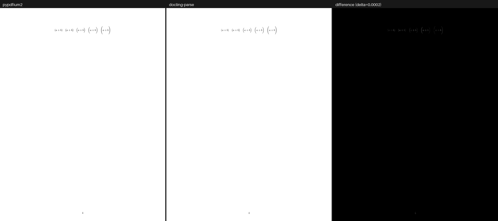
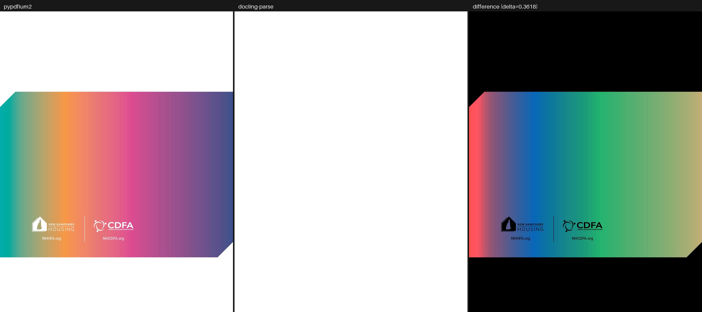
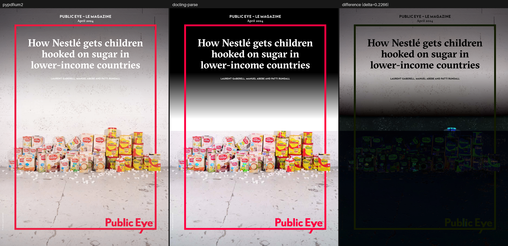
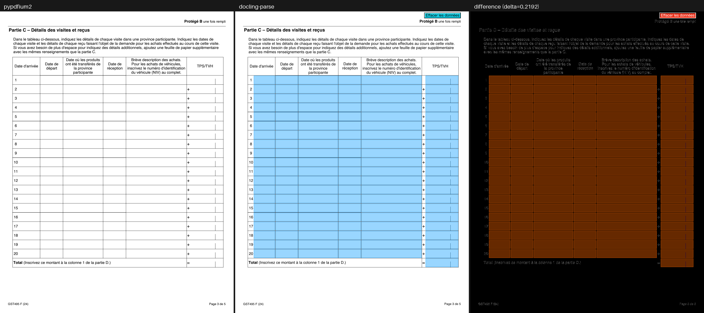

# Quality Benchmarks

Rendering quality of `docling-parse` measured against **pypdfium2** on the
regression corpus: 108 pages across 75 documents, rasterised twice and compared
pixel by pixel.

PDFium is the reference because it is an independent, widely deployed
implementation of the same specification — not because it is correct by
definition. A difference is a question to investigate, not automatically a bug
in `docling-parse`. Nothing on this page is a CI gate; the numbers are a report.

## Reproducing

```console
uv run pytest tests/test_pypdfium_render.py -q -s --render-visualizations all
```

The test prints the table below and writes one three-panel PNG per page into
`tests/data/visualizations/`. The images in [`./quality_benchmarks/`](./quality_benchmarks/)
are that output, copied in.

`--render-visualizations` selects how much is written:

| value | writes a visualisation for |
| --- | --- |
| `all` | every page |
| `above-tolerance` | only pages over the reporting cut-off (the default) |
| `none` | nothing |

Both renderers work at `scale = 2.0` (144 dpi). The test never fails on pixel
differences — it fails only when there is nothing to compare, e.g. when
`pypdfium2` is not installed.

## How to read a visualisation

Each PNG holds three panels of the same page:

| panel | content |
| --- | --- |
| left | `pypdfium2` — the reference render |
| centre | `docling-parse` — the Blend2D render |
| right | the per-pixel absolute difference of the two |

The difference panel carries **no brightness scaling**. A grey level of 40 means
the two renders are 40 apart at that pixel, and black means they agree. That
also makes any two panels directly comparable: they are produced by the same
fixed transform, so a panel from one page can be held next to a panel from
another. Amplifying — even by a constant — would break that, by making a
near-identical page look as damaged as a broken one.

The price is that an accurate page shows an almost black panel. That is the
honest depiction of two renders agreeing, and the metrics below are what
resolve differences too small to see.



*The closest page in the corpus (`delta = 0.0002`, `mean_abs_error = 0.0295`):
the difference panel is black. The two renderers put this page on screen the
same way.*

## Metrics

Both renders are composited onto opaque white before anything is measured —
`pypdfium2` paints an opaque page while the Blend2D path can leave the
background transparent, and comparing them only makes sense on a common
background.

**`delta`** — the headline number, on a **0.0 – 1.0** scale.

> Per pixel, take the *largest* of the three channel differences and divide by
> 255; the score is the mean of that over the page.

`0.0` is a pixel-identical render and `1.0` is every pixel maximally inverted —
a bound that is actually attainable, which is what makes the number comparable
across pages of different size. A page that differs on 5 % of its area, fully,
scores `0.0500`; the same 5 % differing by half scores `0.0249`.

Two deliberate choices behind it. Alpha is excluded, since after flattening both
alpha channels are identical by construction. And the channels are combined with
`max()` rather than averaged: a glyph painted pure blue where it should be black
differs by 255 in one channel, which a mean reports as 85 and a luma weighting
as 29 — both understating a difference that is entirely obvious on screen.

`delta` is still an average over the whole page, so it is dominated by page
area. A mostly-white page with badly wrong text scores low in absolute terms.
It ranks pages against each other; it does not say "this render is 3 % wrong".

The remaining columns are the raw quantities it is derived from:

| column | meaning |
| --- | --- |
| `canvas` | render size in pixels; `pypdfium2` and `docling-parse` agreed exactly on all 108 pages |
| `mean_abs_error` | mean absolute per-channel deviation over RGBA, in 0–255 units. Alpha is constant, so this saturates at 191.25 rather than 255 |
| `changed_pixels_ratio` | fraction of pixels whose luma-weighted difference exceeds 12 |
| `max_abs_error` | largest single-channel deviation anywhere on the page |
| `changed_pixels` | absolute count behind `changed_pixels_ratio` |

## Summary

| statistic | `mean_abs_error` | `delta` |
| --- | ---: | ---: |
| best page | 0.0295 | 0.0002 |
| median | 2.3897 | 0.0129 |
| mean | 3.5289 | 0.0231 |
| 95th percentile | 7.9852 | 0.0569 |
| worst page | 48.3654 | 0.3618 |

| | pages |
| --- | ---: |
| `delta` < 0.01 | 42 / 108 (39 %) |
| `delta` < 0.02 | 83 / 108 (77 %) |
| `delta` < 0.05 | 102 / 108 (94 %) |
| `delta` < 0.10 | 104 / 108 (96 %) |

Nearly all of the corpus sits below a `delta` of `0.05`, and the distribution
has a long thin tail: four pages account for everything above `0.10`. Those four
are also the top four by `mean_abs_error`, so both metrics agree on where the
problems are.

## The tail

### `device_n_black.pdf` page 1 — `mean_abs_error` 48.37, `delta` 0.3618



The worst page in the corpus, and a known limitation rather than a mystery:
`pdf_resource<PAGE_COLORSPACE>` does not evaluate the tint transform function of
`/Separation` and `/DeviceN` colour spaces. It approximates a tint by darkening
towards black (`src/parse/pdf_resources/page_colorspace.h`), so any document
whose ink is defined through a tint transform renders in the wrong colour.

### `complex_invisible_fonts_01.pdf` page 1 — `mean_abs_error` 39.71, `delta` 0.2266



Over half the page differs (`changed_pixels_ratio = 0.5393`). Not yet
characterised.

### `form_fields.pdf` page 3 — `mean_abs_error` 20.31, and `fillable_form.pdf` — 16.31



Widget annotations, and again a known limitation rather than a decoding
failure. Each text field emits a `text_widget_instruction`, which
`renderer<BLEND2D>::render_widget` paints as a translucent light-blue
quadrilateral over the field's bounds — a debug visualisation PDFium has no
counterpart for. The field's own `/AP/N` appearance stream *is* decoded and
re-emitted, so its content is drawn; the blue overlay simply sits on top of it,
and a form-heavy page therefore differs across every field.

The other four `form_fields.pdf` pages sit between 3.36 and 6.41, which is the
same effect at a lower field density.

The overlay is now opt-in: `render_config::display_widgets` defaults to `false`,
so a default render draws only the field content and no longer diverges from
PDFium here. Setting it to `true` (colour configurable through
`render_config::color_widgets`) brings the overlay — and these numbers — back.
The measurements in the table below predate that switch and were taken with the
overlay always on; the `form_fields.pdf` and `fillable_form.pdf` rows are
therefore stale until the table is regenerated.

## Per-page results

Sorted by `mean_abs_error`, worst first, as the test prints them. The `delta`
value links to that page's three-panel visualisation.

<!-- Generated from `pytest tests/test_pypdfium_render.py --render-visualizations all`. -->

| document | page | canvas | mean_abs_error | delta | changed_pixels_ratio | max_abs_error | changed_pixels |
| --- | ---: | :---: | ---: | ---: | ---: | ---: | ---: |
| `device_n_black.pdf` | 1 | 1224x1584 | 48.3654 | [0.3618](./quality_benchmarks/delta_0.3618_device_n_black.pdf.page_no_1.png) | 0.5442 | 255 | 1,055,109 |
| `complex_invisible_fonts_01.pdf` | 1 | 1191x1684 | 39.7102 | [0.2266](./quality_benchmarks/delta_0.2266_complex_invisible_fonts_01.pdf.page_no_1.png) | 0.5393 | 249 | 1,081,561 |
| `form_fields.pdf` | 3 | 1224x1584 | 20.3136 | [0.2192](./quality_benchmarks/delta_0.2192_form_fields.pdf.page_no_3.png) | 0.5278 | 255 | 1,023,351 |
| `fillable_form.pdf` | 1 | 1224x1584 | 16.3081 | [0.1578](./quality_benchmarks/delta_0.1578_fillable_form.pdf.page_no_1.png) | 0.3969 | 255 | 769,495 |
| `cropbox_versus_mediabox_01.pdf` | 1 | 1191x1684 | 8.1218 | [0.0447](./quality_benchmarks/delta_0.0447_cropbox_versus_mediabox_01.pdf.page_no_1.png) | 0.2612 | 255 | 523,944 |
| `cropbox_versus_mediabox_02.pdf` | 1 | 1088x1266 | 7.9852 | [0.0711](./quality_benchmarks/delta_0.0711_cropbox_versus_mediabox_02.pdf.page_no_1.png) | 0.3142 | 164 | 432,731 |
| `cropbox_versus_mediabox_02.pdf` | 2 | 1088x1266 | 7.5061 | [0.0569](./quality_benchmarks/delta_0.0569_cropbox_versus_mediabox_02.pdf.page_no_2.png) | 0.2292 | 255 | 315,711 |
| `ligatures_01.pdf` | 1 | 1224x1584 | 6.7581 | [0.0358](./quality_benchmarks/delta_0.0358_ligatures_01.pdf.page_no_1.png) | 0.1125 | 255 | 218,143 |
| `complex_invisible_fonts_05.pdf` | 1 | 1191x1684 | 6.7035 | [0.0480](./quality_benchmarks/delta_0.0480_complex_invisible_fonts_05.pdf.page_no_1.png) | 0.1030 | 161 | 206,519 |
| `complex_invisible_fonts_04.pdf` | 1 | 1191x1684 | 6.5165 | [0.0472](./quality_benchmarks/delta_0.0472_complex_invisible_fonts_04.pdf.page_no_1.png) | 0.0929 | 172 | 186,413 |
| `form_fields.pdf` | 5 | 1224x1584 | 6.4116 | [0.0349](./quality_benchmarks/delta_0.0349_form_fields.pdf.page_no_5.png) | 0.1425 | 255 | 276,235 |
| `font_10.pdf` | 1 | 1224x1584 | 5.6791 | [0.0419](./quality_benchmarks/delta_0.0419_font_10.pdf.page_no_1.png) | 0.2438 | 225 | 472,724 |
| `complex_invisible_fonts_02.pdf` | 1 | 1191x1684 | 5.6336 | [0.0321](./quality_benchmarks/delta_0.0321_complex_invisible_fonts_02.pdf.page_no_1.png) | 0.1364 | 202 | 273,511 |
| `font_07.pdf` | 1 | 1191x1571 | 5.5806 | [0.0370](./quality_benchmarks/delta_0.0370_font_07.pdf.page_no_1.png) | 0.1308 | 209 | 244,734 |
| `form_fields.pdf` | 1 | 1224x1584 | 5.3546 | [0.0443](./quality_benchmarks/delta_0.0443_form_fields.pdf.page_no_1.png) | 0.1247 | 255 | 241,849 |
| `form_fields.pdf` | 4 | 1224x1584 | 5.2383 | [0.0398](./quality_benchmarks/delta_0.0398_form_fields.pdf.page_no_4.png) | 0.1239 | 255 | 240,266 |
| `ligatures_01.pdf` | 2 | 1224x1584 | 4.4533 | [0.0233](./quality_benchmarks/delta_0.0233_ligatures_01.pdf.page_no_2.png) | 0.1275 | 175 | 247,143 |
| `11831013430589524848.pdf` | 1 | 1440x1080 | 4.4050 | [0.0312](./quality_benchmarks/delta_0.0312_11831013430589524848.pdf.page_no_1.png) | 0.1493 | 255 | 232,147 |
| `ccitt_complex_image_scan.pdf` | 1 | 1224x1584 | 4.1427 | [0.0217](./quality_benchmarks/delta_0.0217_ccitt_complex_image_scan.pdf.page_no_1.png) | 0.0786 | 255 | 152,350 |
| `indexed_device_n.pdf` | 1 | 2382x1684 | 3.9798 | [0.0277](./quality_benchmarks/delta_0.0277_indexed_device_n.pdf.page_no_1.png) | 0.1215 | 203 | 487,471 |
| `ligatures_01.pdf` | 3 | 1224x1584 | 3.9536 | [0.0207](./quality_benchmarks/delta_0.0207_ligatures_01.pdf.page_no_3.png) | 0.1139 | 201 | 220,891 |
| `indexed_iccbased.pdf` | 1 | 1224x1512 | 3.6519 | [0.0205](./quality_benchmarks/delta_0.0205_indexed_iccbased.pdf.page_no_1.png) | 0.1234 | 155 | 228,284 |
| `stream_parameter_misinterpretation_01.pdf` | 1 | 1224x1584 | 3.6163 | [0.0191](./quality_benchmarks/delta_0.0191_stream_parameter_misinterpretation_01.pdf.page_no_1.png) | 0.0999 | 255 | 193,714 |
| `ligatures_01.pdf` | 4 | 1224x1584 | 3.5698 | [0.0190](./quality_benchmarks/delta_0.0190_ligatures_01.pdf.page_no_4.png) | 0.1012 | 241 | 196,249 |
| `6480366468566741514.pdf` | 1 | 1190x1684 | 3.4959 | [0.0206](./quality_benchmarks/delta_0.0206_6480366468566741514.pdf.page_no_1.png) | 0.1038 | 218 | 208,021 |
| `font_11.pdf` | 2 | 1191x1582 | 3.4476 | [0.0191](./quality_benchmarks/delta_0.0191_font_11.pdf.page_no_2.png) | 0.0997 | 233 | 187,878 |
| `font_06.pdf` | 1 | 1190x1588 | 3.4216 | [0.0179](./quality_benchmarks/delta_0.0179_font_06.pdf.page_no_1.png) | 0.0952 | 255 | 179,826 |
| `device_gray_01.pdf` | 1 | 1224x1584 | 3.3863 | [0.0177](./quality_benchmarks/delta_0.0177_device_gray_01.pdf.page_no_1.png) | 0.0604 | 255 | 117,038 |
| `form_fields.pdf` | 2 | 1224x1584 | 3.3594 | [0.0286](./quality_benchmarks/delta_0.0286_form_fields.pdf.page_no_2.png) | 0.0790 | 255 | 153,127 |
| `font_05.pdf` | 1 | 868x1327 | 3.3510 | [0.0175](./quality_benchmarks/delta_0.0175_font_05.pdf.page_no_1.png) | 0.0951 | 163 | 109,555 |
| `font_09.pdf` | 1 | 1190x1684 | 3.2271 | [0.0169](./quality_benchmarks/delta_0.0169_font_09.pdf.page_no_1.png) | 0.0959 | 166 | 192,190 |
| `rotated_text_07.pdf` | 1 | 1190x1684 | 3.2165 | [0.0168](./quality_benchmarks/delta_0.0168_rotated_text_07.pdf.page_no_1.png) | 0.0503 | 255 | 100,819 |
| `cropbox_versus_mediabox_02.pdf` | 3 | 1088x1266 | 3.1041 | [0.0196](./quality_benchmarks/delta_0.0196_cropbox_versus_mediabox_02.pdf.page_no_3.png) | 0.0993 | 161 | 136,788 |
| `device_cymk_01.pdf` | 1 | 1531x1191 | 3.0553 | [0.0216](./quality_benchmarks/delta_0.0216_device_cymk_01.pdf.page_no_1.png) | 0.1147 | 153 | 209,108 |
| `annots_01.pdf` | 1 | 1191x1684 | 2.8965 | [0.0167](./quality_benchmarks/delta_0.0167_annots_01.pdf.page_no_1.png) | 0.0717 | 255 | 143,766 |
| `2508.13113v2.pdf` | 9 | 1224x1584 | 2.7856 | [0.0151](./quality_benchmarks/delta_0.0151_2508.13113v2.pdf.page_no_9.png) | 0.0749 | 255 | 145,191 |
| `font_11.pdf` | 1 | 1191x1582 | 2.7568 | [0.0146](./quality_benchmarks/delta_0.0146_font_11.pdf.page_no_1.png) | 0.0866 | 196 | 163,259 |
| `math_latex_formulas.pdf` | 3 | 1224x1584 | 2.7421 | [0.0147](./quality_benchmarks/delta_0.0147_math_latex_formulas.pdf.page_no_3.png) | 0.0537 | 237 | 104,081 |
| `4865216256588543301.pdf` | 6 | 1191x1684 | 2.7170 | [0.0142](./quality_benchmarks/delta_0.0142_4865216256588543301.pdf.page_no_6.png) | 0.0676 | 250 | 135,504 |
| `4865216256588543301.pdf` | 3 | 1191x1684 | 2.7078 | [0.0142](./quality_benchmarks/delta_0.0142_4865216256588543301.pdf.page_no_3.png) | 0.0675 | 238 | 135,472 |
| `table_of_contents_01.pdf` | 3 | 1224x1584 | 2.6805 | [0.0140](./quality_benchmarks/delta_0.0140_table_of_contents_01.pdf.page_no_3.png) | 0.0771 | 161 | 149,531 |
| `table_of_contents_01.pdf` | 2 | 1224x1584 | 2.6698 | [0.0140](./quality_benchmarks/delta_0.0140_table_of_contents_01.pdf.page_no_2.png) | 0.0800 | 167 | 155,181 |
| `table_of_contents_01.pdf` | 4 | 1224x1584 | 2.6593 | [0.0139](./quality_benchmarks/delta_0.0139_table_of_contents_01.pdf.page_no_4.png) | 0.0778 | 174 | 150,908 |
| `4865216256588543301.pdf` | 4 | 1191x1684 | 2.6585 | [0.0139](./quality_benchmarks/delta_0.0139_4865216256588543301.pdf.page_no_4.png) | 0.0666 | 235 | 133,521 |
| `math_latex_formulas.pdf` | 1 | 1224x1584 | 2.6476 | [0.0142](./quality_benchmarks/delta_0.0142_math_latex_formulas.pdf.page_no_1.png) | 0.0517 | 242 | 100,287 |
| `type3_fonts.pdf` | 1 | 1224x1584 | 2.6464 | [0.0138](./quality_benchmarks/delta_0.0138_type3_fonts.pdf.page_no_1.png) | 0.0527 | 255 | 102,184 |
| `2508.13113v2.pdf` | 2 | 1224x1584 | 2.6339 | [0.0144](./quality_benchmarks/delta_0.0144_2508.13113v2.pdf.page_no_2.png) | 0.0770 | 255 | 149,280 |
| `4865216256588543301.pdf` | 5 | 1191x1684 | 2.6221 | [0.0137](./quality_benchmarks/delta_0.0137_4865216256588543301.pdf.page_no_5.png) | 0.0658 | 238 | 131,977 |
| `4865216256588543301.pdf` | 8 | 1191x1684 | 2.5880 | [0.0135](./quality_benchmarks/delta_0.0135_4865216256588543301.pdf.page_no_8.png) | 0.0659 | 235 | 132,250 |
| `stream_parameter_misinterpretation_02.pdf` | 1 | 1190x1690 | 2.5878 | [0.0136](./quality_benchmarks/delta_0.0136_stream_parameter_misinterpretation_02.pdf.page_no_1.png) | 0.0645 | 255 | 129,786 |
| `4865216256588543301.pdf` | 7 | 1191x1684 | 2.5755 | [0.0135](./quality_benchmarks/delta_0.0135_4865216256588543301.pdf.page_no_7.png) | 0.0652 | 238 | 130,821 |
| `4865216256588543301.pdf` | 9 | 1191x1684 | 2.4934 | [0.0130](./quality_benchmarks/delta_0.0130_4865216256588543301.pdf.page_no_9.png) | 0.0633 | 237 | 126,962 |
| `test-parent-mediabox.pdf` | 1 | 1920x1080 | 2.4599 | [0.0129](./quality_benchmarks/delta_0.0129_test-parent-mediabox.pdf.page_no_1.png) | 0.0176 | 255 | 36,547 |
| `font_03.pdf` | 1 | 1224x1584 | 2.4003 | [0.0127](./quality_benchmarks/delta_0.0127_font_03.pdf.page_no_1.png) | 0.0585 | 255 | 113,353 |
| `2508.13113v2.pdf` | 17 | 1224x1584 | 2.3791 | [0.0128](./quality_benchmarks/delta_0.0128_2508.13113v2.pdf.page_no_17.png) | 0.0719 | 209 | 139,427 |
| `14770497121209673752.pdf` | 1 | 1191x1684 | 2.2001 | [0.0130](./quality_benchmarks/delta_0.0130_14770497121209673752.pdf.page_no_1.png) | 0.0554 | 255 | 111,086 |
| `annots_02.pdf` | 1 | 1191x1684 | 2.1380 | [0.0115](./quality_benchmarks/delta_0.0115_annots_02.pdf.page_no_1.png) | 0.0507 | 255 | 101,588 |
| `inflate_jpeg.pdf` | 1 | 1224x1584 | 2.1344 | [0.0112](./quality_benchmarks/delta_0.0112_inflate_jpeg.pdf.page_no_1.png) | 0.0354 | 216 | 68,589 |
| `jpeg_retry_logic.pdf` | 1 | 1440x810 | 2.1017 | [0.0138](./quality_benchmarks/delta_0.0138_jpeg_retry_logic.pdf.page_no_1.png) | 0.0322 | 255 | 37,616 |
| `580-17-PIB_Unfall-Provinzial-IPID_Stand-12.2016.pdf` | 1 | 1191x1684 | 2.0456 | [0.0115](./quality_benchmarks/delta_0.0115_580-17-PIB_Unfall-Provinzial-IPID_Stand-12.2016.pdf.page_no_1.png) | 0.0604 | 225 | 121,057 |
| `font_02.pdf` | 1 | 1224x1584 | 2.0085 | [0.0123](./quality_benchmarks/delta_0.0123_font_02.pdf.page_no_1.png) | 0.0471 | 255 | 91,410 |
| `deep-mediabox-inheritance.pdf` | 2 | 1190x1684 | 1.9939 | [0.0104](./quality_benchmarks/delta_0.0104_deep-mediabox-inheritance.pdf.page_no_2.png) | 0.0562 | 171 | 112,566 |
| `rotated_page_02.pdf` | 1 | 906x1305 | 1.9296 | [0.0101](./quality_benchmarks/delta_0.0101_rotated_page_02.pdf.page_no_1.png) | 0.0578 | 178 | 68,333 |
| `580-17-PIB_Unfall-Provinzial-IPID_Stand-12.2016.pdf` | 2 | 1191x1684 | 1.8664 | [0.0103](./quality_benchmarks/delta_0.0103_580-17-PIB_Unfall-Provinzial-IPID_Stand-12.2016.pdf.page_no_2.png) | 0.0509 | 196 | 102,025 |
| `right_to_left_03.pdf` | 1 | 1191x1685 | 1.8608 | [0.0100](./quality_benchmarks/delta_0.0100_right_to_left_03.pdf.page_no_1.png) | 0.0424 | 221 | 85,061 |
| `complex_jbig2_overlays.pdf` | 1 | 1224x1584 | 1.8587 | [0.0099](./quality_benchmarks/delta_0.0099_complex_jbig2_overlays.pdf.page_no_1.png) | 0.0369 | 255 | 71,470 |
| `text_as_lines_02.pdf` | 1 | 1190x1684 | 1.8518 | [0.0099](./quality_benchmarks/delta_0.0099_text_as_lines_02.pdf.page_no_1.png) | 0.0429 | 251 | 86,023 |
| `4865216256588543301.pdf` | 2 | 1191x1684 | 1.8088 | [0.0095](./quality_benchmarks/delta_0.0095_4865216256588543301.pdf.page_no_2.png) | 0.0590 | 242 | 118,247 |
| `rotated_text_03.pdf` | 1 | 737x843 | 1.8023 | [0.0107](./quality_benchmarks/delta_0.0107_rotated_text_03.pdf.page_no_1.png) | 0.0542 | 196 | 33,677 |
| `right_to_left_04.pdf` | 1 | 1191x1684 | 1.7545 | [0.0092](./quality_benchmarks/delta_0.0092_right_to_left_04.pdf.page_no_1.png) | 0.0422 | 252 | 84,719 |
| `text_as_lines_01.pdf` | 1 | 1190x1684 | 1.7059 | [0.0089](./quality_benchmarks/delta_0.0089_text_as_lines_01.pdf.page_no_1.png) | 0.0482 | 247 | 96,567 |
| `font_01.pdf` | 1 | 1224x1584 | 1.6493 | [0.0086](./quality_benchmarks/delta_0.0086_font_01.pdf.page_no_1.png) | 0.0450 | 203 | 87,225 |
| `rotated_text_04.pdf` | 1 | 737x843 | 1.5652 | [0.0091](./quality_benchmarks/delta_0.0091_rotated_text_04.pdf.page_no_1.png) | 0.0585 | 155 | 36,345 |
| `PDF32000_2008.pdf` | 2 | 1190x1684 | 1.5193 | [0.0083](./quality_benchmarks/delta_0.0083_PDF32000_2008.pdf.page_no_2.png) | 0.0424 | 255 | 84,912 |
| `rotated_text_01.pdf` | 1 | 737x843 | 1.4389 | [0.0094](./quality_benchmarks/delta_0.0094_rotated_text_01.pdf.page_no_1.png) | 0.0595 | 156 | 36,967 |
| `core14-alias-no-widths-extended.pdf` | 1 | 1224x1584 | 1.4364 | [0.0075](./quality_benchmarks/delta_0.0075_core14-alias-no-widths-extended.pdf.page_no_1.png) | 0.0237 | 255 | 45,931 |
| `rotated_text_06.pdf` | 1 | 737x843 | 1.3938 | [0.0077](./quality_benchmarks/delta_0.0077_rotated_text_06.pdf.page_no_1.png) | 0.0567 | 119 | 35,199 |
| `table_of_contents_01.pdf` | 1 | 1224x1584 | 1.3766 | [0.0072](./quality_benchmarks/delta_0.0072_table_of_contents_01.pdf.page_no_1.png) | 0.0415 | 169 | 80,501 |
| `rotated_text_05.pdf` | 1 | 737x843 | 1.2137 | [0.0064](./quality_benchmarks/delta_0.0064_rotated_text_05.pdf.page_no_1.png) | 0.0476 | 119 | 29,546 |
| `rotated_text_02.pdf` | 1 | 737x843 | 1.2128 | [0.0064](./quality_benchmarks/delta_0.0064_rotated_text_02.pdf.page_no_1.png) | 0.0482 | 119 | 29,952 |
| `rotated_page_01.pdf` | 1 | 1584x1224 | 1.2105 | [0.0076](./quality_benchmarks/delta_0.0076_rotated_page_01.pdf.page_no_1.png) | 0.0425 | 206 | 82,334 |
| `duplicate_bold_text_01.pdf` | 1 | 1191x1684 | 1.1754 | [0.0063](./quality_benchmarks/delta_0.0063_duplicate_bold_text_01.pdf.page_no_1.png) | 0.0262 | 209 | 52,590 |
| `right_to_left.pdf` | 1 | 1224x1584 | 1.1304 | [0.0059](./quality_benchmarks/delta_0.0059_right_to_left.pdf.page_no_1.png) | 0.0280 | 255 | 54,249 |
| `right_to_left_02.pdf` | 1 | 1191x1684 | 1.0205 | [0.0063](./quality_benchmarks/delta_0.0063_right_to_left_02.pdf.page_no_1.png) | 0.0277 | 154 | 55,465 |
| `10400964487025769287.pdf` | 1 | 1190x1684 | 1.0034 | [0.0052](./quality_benchmarks/delta_0.0052_10400964487025769287.pdf.page_no_1.png) | 0.0257 | 233 | 51,480 |
| `text_as_lines_01.pdf` | 3 | 1190x1684 | 0.9971 | [0.0052](./quality_benchmarks/delta_0.0052_text_as_lines_01.pdf.page_no_3.png) | 0.0287 | 247 | 57,506 |
| `broken_media_box_v01.pdf` | 1 | 1584x1224 | 0.8929 | [0.0056](./quality_benchmarks/delta_0.0056_broken_media_box_v01.pdf.page_no_1.png) | 0.0313 | 198 | 60,649 |
| `4865216256588543301.pdf` | 1 | 1191x1684 | 0.8354 | [0.0044](./quality_benchmarks/delta_0.0044_4865216256588543301.pdf.page_no_1.png) | 0.0214 | 200 | 42,955 |
| `text_as_lines_01.pdf` | 2 | 1190x1684 | 0.8082 | [0.0042](./quality_benchmarks/delta_0.0042_text_as_lines_01.pdf.page_no_2.png) | 0.0250 | 255 | 50,011 |
| `math_latex_formulas.pdf` | 2 | 1224x1584 | 0.7507 | [0.0039](./quality_benchmarks/delta_0.0039_math_latex_formulas.pdf.page_no_2.png) | 0.0181 | 211 | 35,055 |
| `dln-v1.pdf` | 1 | 1152x1152 | 0.7228 | [0.0042](./quality_benchmarks/delta_0.0042_dln-v1.pdf.page_no_1.png) | 0.0135 | 255 | 17,974 |
| `4865216256588543301.pdf` | 10 | 1191x1684 | 0.6692 | [0.0035](./quality_benchmarks/delta_0.0035_4865216256588543301.pdf.page_no_10.png) | 0.0158 | 168 | 31,742 |
| `font_04.pdf` | 1 | 1191x1684 | 0.5508 | [0.0029](./quality_benchmarks/delta_0.0029_font_04.pdf.page_no_1.png) | 0.0152 | 187 | 30,564 |
| `font_08.pdf` | 1 | 1190x1684 | 0.4988 | [0.0026](./quality_benchmarks/delta_0.0026_font_08.pdf.page_no_1.png) | 0.0142 | 236 | 28,548 |
| `bitmap_decoding_01.pdf` | 1 | 1224x1584 | 0.3782 | [0.0020](./quality_benchmarks/delta_0.0020_bitmap_decoding_01.pdf.page_no_1.png) | 0.0089 | 255 | 17,228 |
| `ccitt_with_invisiable_text.pdf` | 1 | 1225x1608 | 0.3181 | [0.0017](./quality_benchmarks/delta_0.0017_ccitt_with_invisiable_text.pdf.page_no_1.png) | 0.0107 | 129 | 21,136 |
| `jpeg_2000_01.pdf` | 1 | 1191x1720 | 0.2732 | [0.0019](./quality_benchmarks/delta_0.0019_jpeg_2000_01.pdf.page_no_1.png) | 0.0076 | 215 | 15,654 |
| `PDF32000_2008.pdf` | 1 | 1190x1684 | 0.2705 | [0.0014](./quality_benchmarks/delta_0.0014_PDF32000_2008.pdf.page_no_1.png) | 0.0059 | 238 | 11,867 |
| `jbig2_test_01.pdf` | 1 | 1584x1224 | 0.2225 | [0.0015](./quality_benchmarks/delta_0.0015_jbig2_test_01.pdf.page_no_1.png) | 0.0058 | 179 | 11,195 |
| `rotated_image.pdf` | 1 | 1584x1224 | 0.2225 | [0.0015](./quality_benchmarks/delta_0.0015_rotated_image.pdf.page_no_1.png) | 0.0058 | 179 | 11,195 |
| `6480366468566741514.pdf` | 2 | 1190x1684 | 0.1584 | [0.0008](./quality_benchmarks/delta_0.0008_6480366468566741514.pdf.page_no_2.png) | 0.0054 | 147 | 10,916 |
| `math_latex_formulas.pdf` | 5 | 1224x1584 | 0.1464 | [0.0008](./quality_benchmarks/delta_0.0008_math_latex_formulas.pdf.page_no_5.png) | 0.0032 | 212 | 6,222 |
| `ocr_test_rotated_000.pdf` | 1 | 1191x1684 | 0.1417 | [0.0007](./quality_benchmarks/delta_0.0007_ocr_test_rotated_000.pdf.page_no_1.png) | 0.0043 | 123 | 8,663 |
| `ocr_test_rotated_090.pdf` | 1 | 1684x1191 | 0.1417 | [0.0007](./quality_benchmarks/delta_0.0007_ocr_test_rotated_090.pdf.page_no_1.png) | 0.0043 | 123 | 8,663 |
| `ocr_test_rotated_180.pdf` | 1 | 1191x1684 | 0.1417 | [0.0007](./quality_benchmarks/delta_0.0007_ocr_test_rotated_180.pdf.page_no_1.png) | 0.0043 | 123 | 8,663 |
| `ocr_test_rotated_270.pdf` | 1 | 1684x1191 | 0.1417 | [0.0007](./quality_benchmarks/delta_0.0007_ocr_test_rotated_270.pdf.page_no_1.png) | 0.0043 | 123 | 8,663 |
| `macroman_encoding_bug_demo.pdf` | 1 | 1224x1584 | 0.0721 | [0.0004](./quality_benchmarks/delta_0.0004_macroman_encoding_bug_demo.pdf.page_no_1.png) | 0.0018 | 255 | 3,404 |
| `math_latex_formulas.pdf` | 4 | 1224x1584 | 0.0295 | [0.0002](./quality_benchmarks/delta_0.0002_math_latex_formulas.pdf.page_no_4.png) | 0.0009 | 121 | 1,738 |
